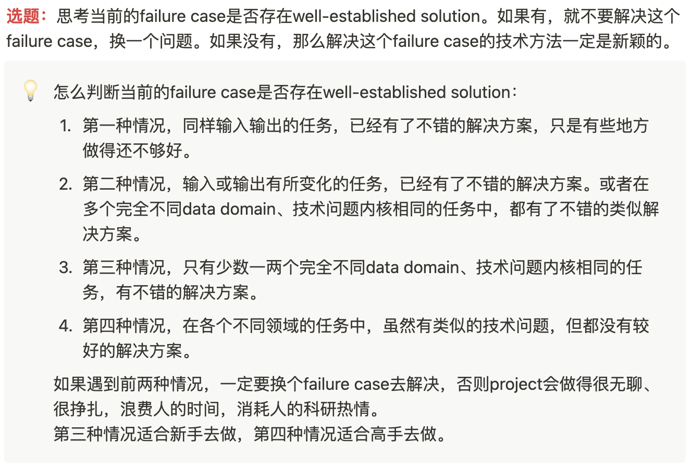

<!--
source: notion page Project核心技术问题分析模板
source page id: 1753fe29-2ff1-8094-8215-cf82cd2b30ae
source fetched: 2026-09-11
status: verified against the Chinese source over 3 rounds, last on 2026-09-12. The final round found nothing. Still needs review by a Chinese reader.
figures: 2, kept as-is
-->

# Template for Analyzing a Project's Core Technical Problems

> [Original Article](https://pengsida.notion.site/1753fe292ff180948215cf82cd2b30ae)

> **Translator's note.** This is a fill-in template; `xx` marks a blank he leaves for you. One section contains a long AI-generated explanation of the Einstein quotation, pasted in from a chat session. Its substance is condensed here rather than translated line by line, since it is generated filler around a single point.

> The top-level project design content of this document has moved into the strategic planning diagram PPT.
> This document is mainly for recording the concrete planning during a project's execution, the problems met, the techniques proposed, and the experiment records.

#### Project setting

Input: xx

Output: xx

Which industries do you want to apply this task to (one or several): xx

What key needs does the target industry have for this task (ordered by priority)

xx

What key need does this project want to meet: xx

#### Overall project plan

- [ ] 1. Build a baseline, run it, and see how far its results are from the key need.
- [ ] 2. Analyze the underlying technical problem causing that gap.
- [ ] 3. Design an idea for solving the problem from first principles.
- [ ] 4. Run exploratory experiments.

#### High-priority problems met while the project moves forward

#### Survey of related work

Technical paradigm 1: xx

1. Paper 1
2. Paper 2

Limitations of technical paradigm 1:

Why it has those limitations:

Technical paradigm 2: xx

1. Paper 1
2. Paper 2

Limitations of technical paradigm 2:

Why it has those limitations:

Not the same task, but related papers

Technical paradigm 3: xx

1. Paper 1

#### Decide whether the application need you started from is the most important and most valuable need right now

> **note**
> Einstein said: If I had an hour to solve a problem I'd spend 55 minutes thinking about the problem and 5 minutes thinking about solutions.

An interpretation of that Einstein line

The source records an AI chat explaining the quotation. Its substance, condensed:

Understanding and defining the problem matters far more than rushing to find a solution. The 55 minutes cover clarifying the problem, gathering information, identifying root causes, considering different angles and avoiding false assumptions; once the problem is properly understood, the solution is often obvious or much easier to reach. Many failures to solve a problem come from not understanding it well enough, so time spent on problem definition reduces mistakes and saves total time. It compares this to the Chinese saying that sharpening the axe does not delay the woodcutting, and notes that established methodologies such as the Five Whys and design thinking embody the same principle, with problem definition taking the larger share and execution the smaller one. The closing line: spending time understanding the problem correctly is half of solving it.

Analysis

Which industry do you want to move forward: xx

Within that industry, which needs can the task still not meet (ordered by importance):

1. xx
2. xx

Among those needs, which has the largest impact (think about which need affects more industries, and which situation is more widespread):

1. xx
2. xx

From the analysis above, decide whether the application need you started from is the most important and most valuable need right now: yes / no

#### Confirm the core technical problem the project wants to solve

The core technical problem behind that limitation: xx

Which of the situations does this problem belong to: the first / second / third / fourth

#### Breaking the problem down

The key to solving the core technical problem is solving the following few problems:

1. xx
2. xx

#### Possible solutions to the core technical problem

Solution 1: xx

Solution 2: xx

#### New techniques that might be usable

> **note**
> Solving the problem means we have to out-grind the researchers who came before, and have a better answer than they do on this problem.
> There are two ways:
> 1. There is a new technical advance, or a technique from another field, or an old technique nobody has dug into, and we can take the dividend of that fresh technique to surpass those before us.
>
> 
>
> 2. Genuinely be cleverer than the people before us, meaning researchers worldwide, and invent a new technical paradigm ourselves.

In this research direction, which new techniques, techniques from other fields, or old techniques nobody has dug into do we have that our predecessors did not (the key to doing the project well):

1. xx
2. xx

Which of the problems listed above can new technique 1 solve:

1. xx
2. xx

Which of the problems listed above can new technique 2 solve:

1. xx
2. xx

How to use new technique 1 to solve the core technical problem:
