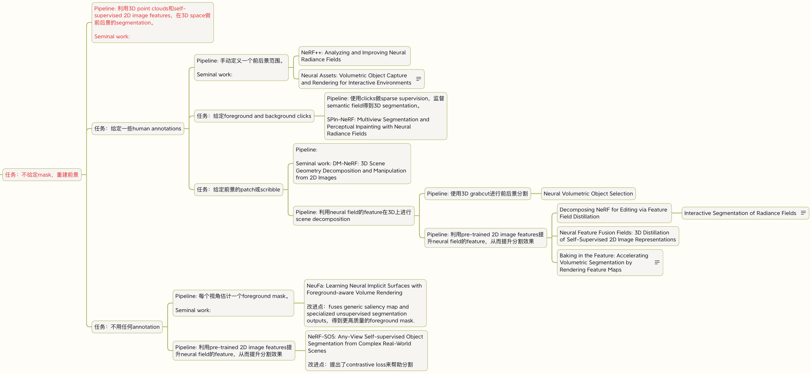

<!--
source: notion page 学习计划参考例子
source page id: 8911dcc5-922b-4442-a80d-4407926e65bf
source fetched: 2026-09-11
status: verified by sonnet, 2026-09-12 (findings applied)
figures: 1, his own, kept as-is
-->

# An Example Study Plan, for Reference

> [Original Article](https://pengsida.notion.site/8911dcc5922b4442a80d4407926e65bf)

The initial goal: study the papers and algorithms of the static scene rendering research direction.

The next goal: study the papers and algorithms of the scene decoupling and editing research direction.

The plan:

1. Study the NeRF algorithm.
   1. Read the NeRF paper.
   2. Study the [NeRF code](https://github.com/yenchenlin/nerf-pytorch) so as to understand the NeRF algorithm completely.
   3. Reproduce NeRF inside this code framework: [https://github.com/pengsida/learning_nerf](https://github.com/pengsida/learning_nerf)
   4. Capture a new dataset yourself, and run NeRF on the code you wrote.
2. Study DFF, the paper related to a senior student's project, and run the matching experiments.
   1. Read [the DFF paper](https://pfnet-research.github.io/distilled-feature-fields/).
   2. Talk with the senior student, and run the DFF experiments.
   3. Study the [DFF code](https://github.com/pfnet-research/distilled-feature-fields) so as to understand the DFF algorithm completely.
3. While running the DFF experiments, read the related papers. There is no need to read them all at once; read them closely one at a time, there is no rush time-wise.

