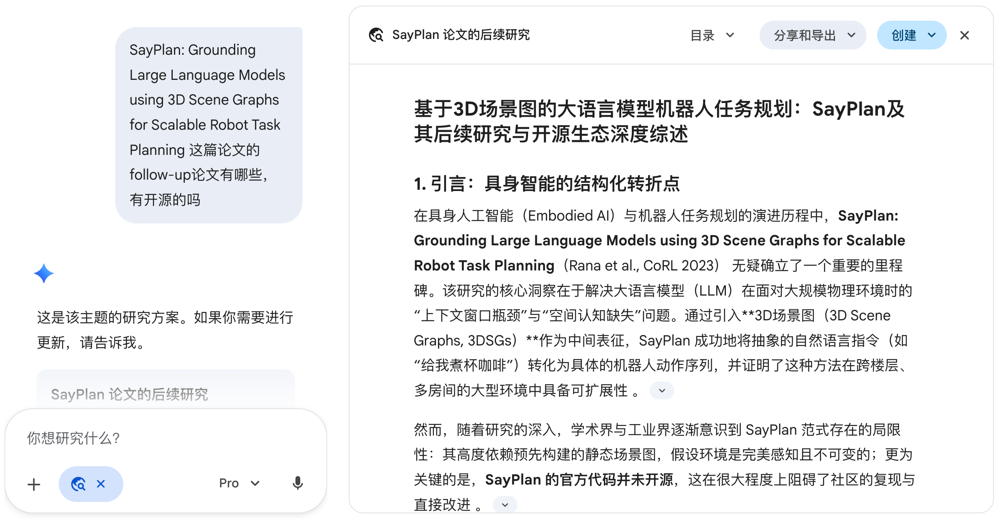

<!--
source: notion page 如何构建literature tree（如何进行literature review，构建novelty tree和challenge-insight tree）
source page id: f8b36e48-4b34-4a28-93a9-4e4608b72ec2
source fetched: 2026-09-11
status: verified against the Chinese source over 4 rounds, last on 2026-09-12. The final round found nothing. Still needs review by a Chinese reader.
figures: 1, a screenshot of a Deep Research session, kept as-is
note: this page is reachable from several of his pages; this is the single canonical translation, per the one-page-one-file rule
-->

# How to Build a Literature Tree (How to Do a Literature Review, and Build a Novelty Tree and a Challenge-Insight Tree)

> [Original Article](https://pengsida.notion.site/f8b36e484b344a2893a94e4608b72ec2)

How to do a literature review: just ask Deep Research.

Example

> **note**
> The content below was written in June 2023. It badly needs updating.

The four classes of novelty

Class 1 novelty: the seminal work of a milestone task.

Class 2 novelty: the seminal work of a novel pipeline or representation.

Class 3 novelty: the seminal work of a novel module.

Class 4 novelty: work that adds some modules to improve an existing pipeline.

How to create a literature tree:

1. Collect papers in the same direction.
2. By reading the papers, sift out the milestone tasks that already exist in this direction, and mark the first paper that proposed each task (class 1 novelty).
3. Group the papers by milestone task. Sift out the representative pipelines and representations, and mark the first paper that proposed each pipeline or representation (class 2 novelty).
4. Subdivide further by pipeline or representation, and group the papers (class 3 novelty).
5. As your understanding of the field grows, add new milestone tasks.

How to create a challenge-insight tree:

1. Collect the challenges met in this field.
2. Collect the insights that solve those challenges.

Example: [a literature tree and challenge-insight tree for the inverse rendering field](https://alidocs.dingtalk.com/i/nodes/QOG9lyrgJPwBpdn0u1B3aO2PVzN67Mw4). (A DingTalk mind map. DingTalk's document sharing does not support sharing directly with outsiders, so permission has to be requested separately. That mind map is only an example and will not be updated later.)

> **note** The text and the example above are somewhat abstract, and may not be able to completely convey what I mean.
> Because a literature review is the key to coming up with ideas, It is suggested that you talk a lot with the senior students in your lab about how to do one.
