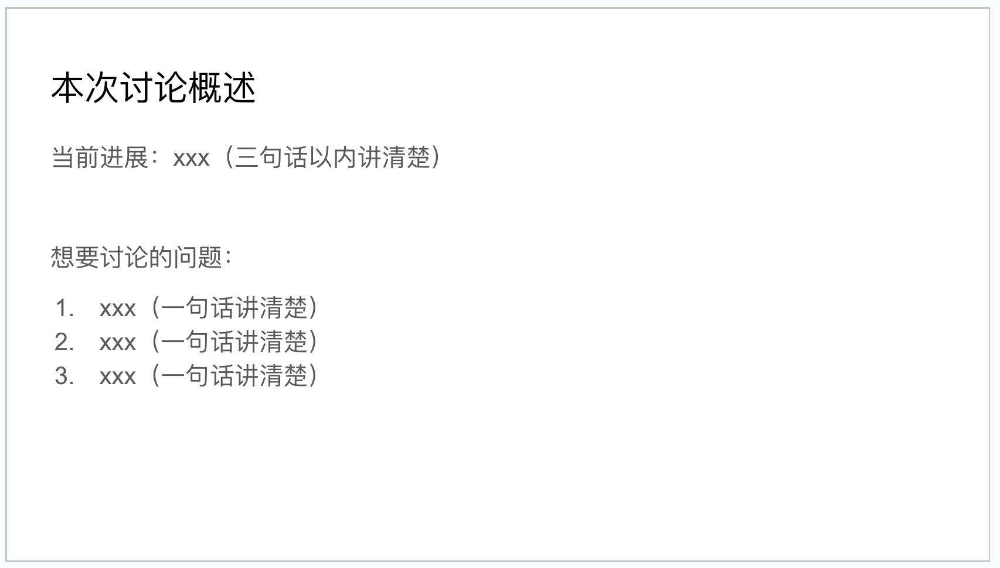
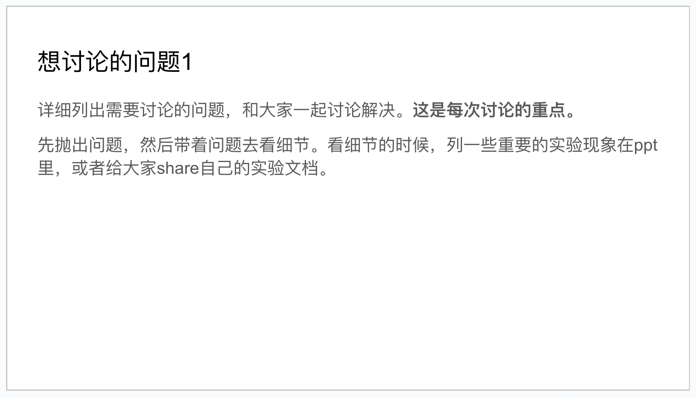
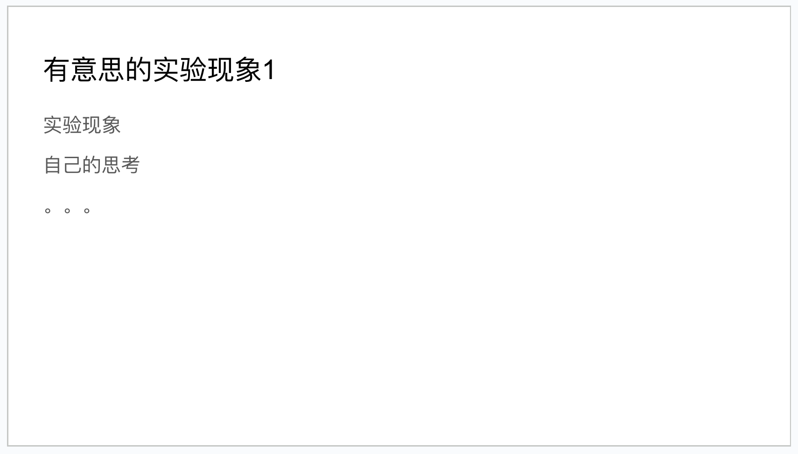
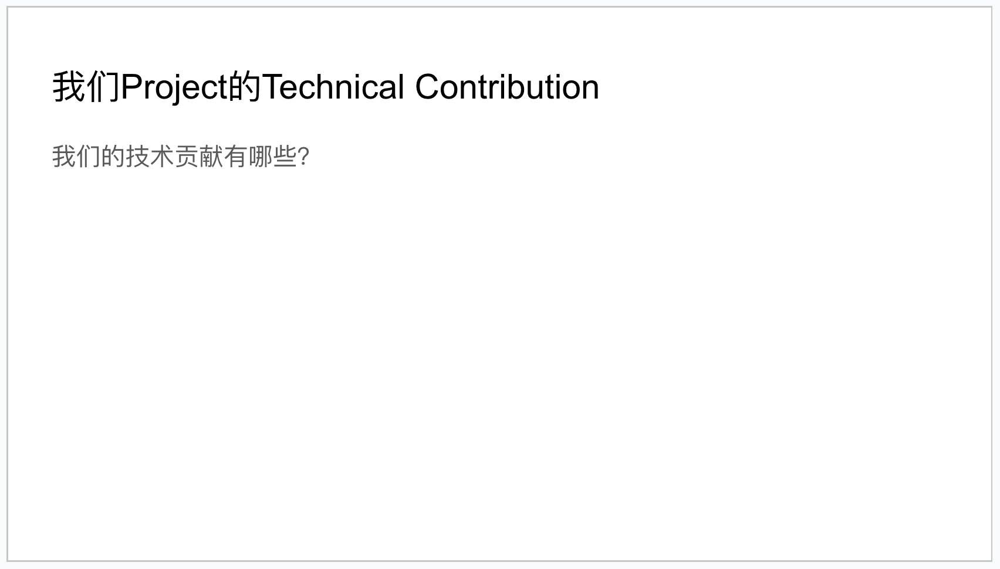
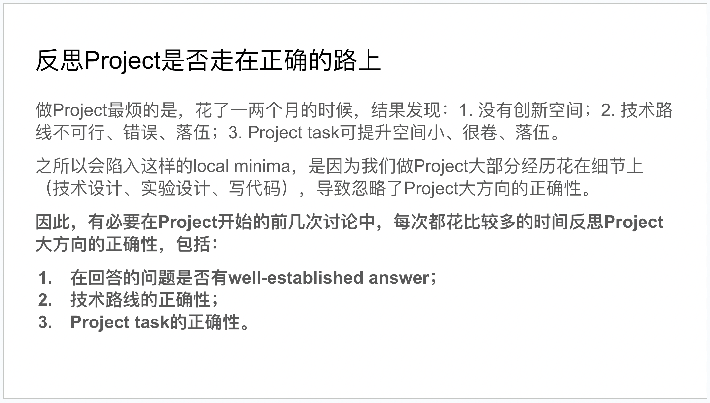
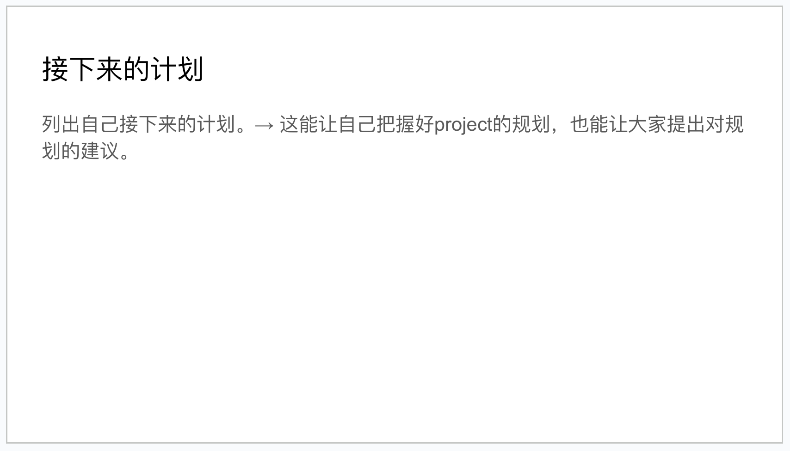
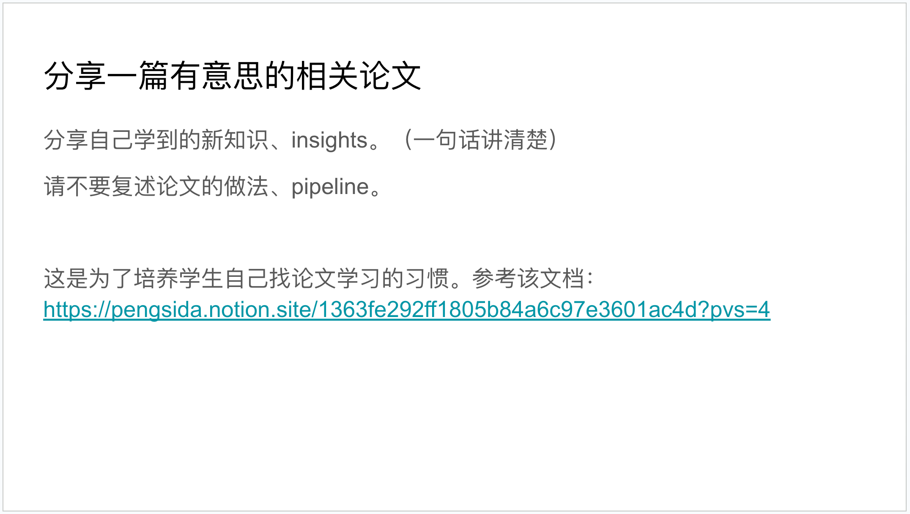

<!--
source: notion page 如何高效地讨论
source page id: d697ef57-8d78-4c86-9d4f-8314f0d617da
source fetched: 2026-09-11
status: verified by sonnet, 2026-09-12 (findings applied)
figures: 9 in the source. Seven are his own slide-template screenshots and are kept. Two are screenshots of a linked Xiaohongshu post and are not copied in.
-->

# How to Hold an Efficient Discussion

> [Original Article](https://pengsida.notion.site/d697ef578d784c869d4f8314f0d617da)

> **Translator's note.** One section of the source draws on a linked Xiaohongshu post, including two screenshots of it and a contrast between two PhD students written in that author's first person. That material is summarized with the link rather than reproduced, since it is not his writing. Everything else here is his, translated in full, with his own slide screenshots kept.

The purpose of a discussion:

1. To get people to help move your project forward. Do not treat a "discussion" as a work report. (Short-term goal.)
2. To build the habit of discussing a problem as soon as you have one. (Long-term goal.)

> **note** If a "discussion" does not discuss a problem but reports progress, it wastes both sides' time. Discuss, do not report.

A classic negative example of a "discussion": long-winded and without focus, wearing down the senior advisor's patience and wasting everyone's time.

> A concrete description of what happens: during the discussion, some students, perhaps afraid that a short discussion would make them look like they had not done anything, pad out the time by presenting papers or presenting trivial experimental phenomena. (They may have hit problems and made little progress, so they think about padding the time; or they may do it for other reasons.)

What is wrong with a discussion like that:

1. It stops the "discussion" putting its focus on solving the problem.
2. A discussion without focus very much wears people's patience down, and wastes the senior advisor's time. A discussion that might have finished quickly gets dragged out to half an hour or an hour.
3. It wastes your own time. You have not let people help you effectively.

The right approach:

1. If there really is no problem, please just skip the discussion and briefly sync on progress and the plan for what comes next.
2. If you have hit a problem, list the problems to discuss and put the discussion's center of gravity on the problems you have hit. It is fine for the discussion to end very quickly. The more efficient the better.
3. In a "discussion", do not present papers and do not present trivial experimental phenomena. Those do not show your own thinking. If you want to share a paper, share it with me at any time and I will certainly find time to read it. What does show your own thinking: intelligent, deep questions, planning for the project, and thought about the technical contribution.

> **note** I can guarantee that in lab discussions, if a project is slow because of technical reasons, nobody will be blamed for that by the senior advisor.

Other positive and negative examples of a "discussion"

From this post: [http://xhslink.com/VBCUFC](http://xhslink.com/VBCUFC)

The source includes two screenshots of that post. They are not copied in here.

The post contrasts two PhD students, written by their supervisor. The one they rate highly does his own thinking when he is stuck, analyzing the possible causes himself and then either proposing a possible solution or asking the supervisor whether they know a better way to solve it; asks around and distils knowledge from other people; structures a meeting clearly, saying what the results are, what problem came up, what it might be caused by, what has already been tried and what might come next; is strong experimentally, solving a problem in a week when given two candidate directions; and is curious, actually going to read papers on a concept mentioned in passing and coming back with a view.

The one they rate poorly reports rather than discusses every week; is weak experimentally, with a list of activity but no progress; lacks his own thinking, answering "I don't know" about causes and showing a program log with nothing added when asked what the problem is; and puts little time into research, going quiet when pointed at a clearer paper in a neighbouring area and later saying he was too busy.

How to hold an efficient discussion:

1. Keep each discussion within half an hour or an hour. If the content is interesting and gets people excited, the discussion will run longer.
2. Because discussion time is limited, discuss the important content first. If I feel I do not know what is being discussed, or feel the content is not important, I will say so.
3. To discuss problems efficiently, you need to prepare slides in advance. [This is the project slides template](https://docs.google.com/presentation/d/1m9SJ6cRZeYXVoqO97x1iCJwWlhDs1bbuzJrKzcSx3Ws/edit#slide=id.g1a080df7cc6_0_17). You can create your own Google Slides and update it using this template as a reference.

   These are the slides from an earlier project, for reference: [https://docs.google.com/presentation/d/19JDX9zjA4Ew3IkDxTlZfvAXiXs1CrHaevJLKBULwjZM/edit?usp=sharing](https://docs.google.com/presentation/d/19JDX9zjA4Ew3IkDxTlZfvAXiXs1CrHaevJLKBULwjZM/edit?usp=sharing)

It does not have to be slides. If you find Notion or Wolai convenient, using those is fine too. The point is to match the format of a discussion.

Organize the slide content like this (do not report progress in detail):

1. One slide that makes the overview of this discussion clear. State the project's progress in three sentences or fewer, and list the problems to be discussed.

   

2. List the problems that need discussing, and solve them together with everyone. Put the problem out first, then go into the details with the problem in mind, and say some of your own thinking. When going into the details, list some important experimental phenomena in the slides, or share your [experiment record](https://pengsida.notion.site/caf34717f4c046c69ee7e14ea953c46f) ([translated](../how-to-keep-experiment-records/README.md)) with everyone.

   

3. List the interesting experimental phenomena and conclusions.

   

4. For a research project discussion, it is necessary to review the technical contribution at every discussion. (Because I have had enough of being slammed by reviewers in reviews for the contribution not being enough, or of finding after several months of a project that there is no contribution, wasting those months.)

   

5. For a research project discussion, it is necessary in the project's first few discussions to discuss each time whether the project's overall direction is correct. (Because I have had enough of finding after one or two months of a project that there is a problem with the overall direction.)

   

6. List your plan for what comes next. This lets you keep a grip on the project's planning, and lets everyone offer suggestions about that plan.

   

7. To build your own habit of reading papers, share one interesting paper from a related direction at each discussion as well.

   

The lab's principles for discussion (important):

1. Communicate fully. When talking, do not be afraid of the teachers or the senior students, and do not let that stop you asking questions. Ask as soon as you have a question. The lab's teachers and senior students are all very friendly and happy to answer questions. The only purpose of a discussion is to be correct and efficient, and to be able to resolve your questions about the project.
2. Talk as equals. This is not a relationship of reporting and being reported to. If you have your own view on the research, express it. If you think a teacher or senior student has said something wrong, question and discuss it politely and properly. Do not simply believe everything teachers and senior students say, but even more, do not appear to comply while doing your own thing underneath, because that wastes a lot of discussion time and experimental cost. The lab's discussions aim at efficient, sincere communication.
