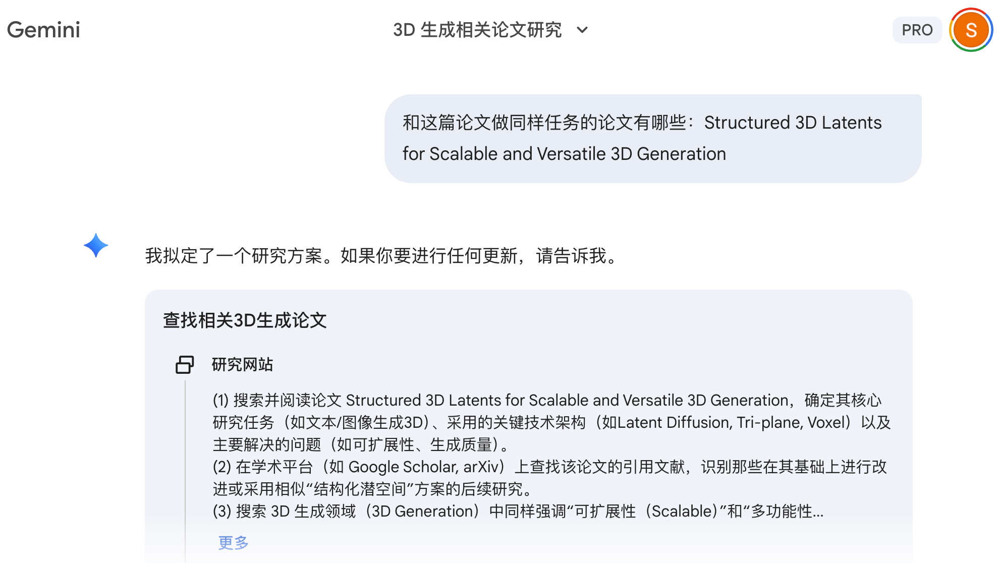
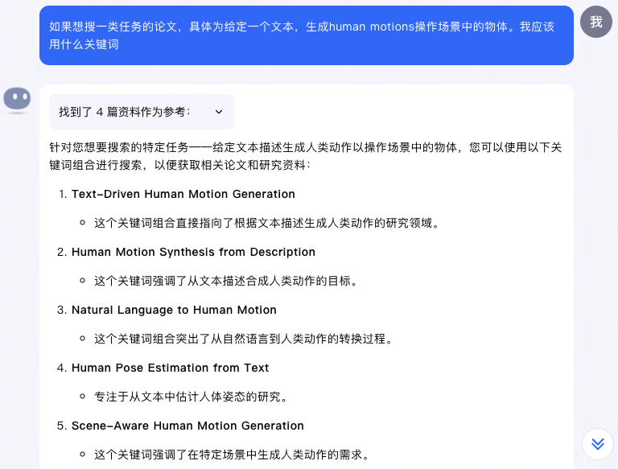
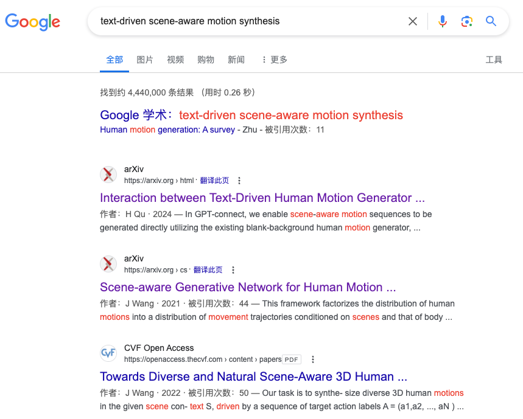
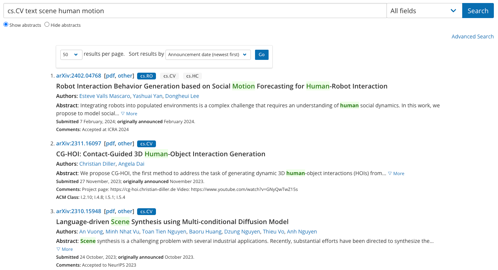

<!--
source: notion page 怎么找论文
source page id: c278dab7-e476-4d61-a92c-1fd1ef3135b1
source fetched: 2026-09-11
status: verified against the Chinese source over 2 rounds, last on 2026-09-12. The final round found nothing. Still needs review by a Chinese reader.
figures: 4, screenshots of AI tool sessions, kept as-is
-->

# How to Find Papers

> [Original Article](https://pengsida.notion.site/c278dab7e4764d61a92c1fd1ef3135b1)

Using Deep Research to find papers, very simple and easy to use:

The outdated approach (before January 2026)

An AI-based paper search site: [https://www.wispaper.ai/scholar-search/](https://www.wispaper.ai/scholar-search/)

1. Ask Kimi for search keywords for related papers, then search on Google and arXiv. Here is an example:

   
   
   

2. Ask Kimi to recommend papers.
3. Build up a store of researchers in the related field as you go, and see whether they have done related work.
4. Build up a store of papers in the related field as you go.
5. Once you have found a related paper, look at the papers it cites and the papers that cite it, and so find more related papers.

