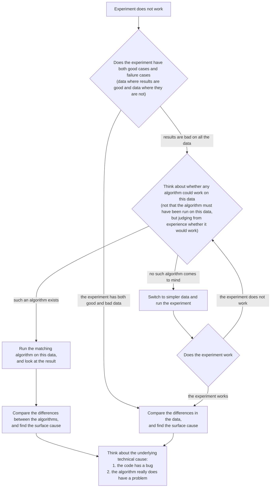

<!--
source: notion page 如何找到实验不work的原因
source page id: 1aee6e71-8de6-472f-834d-13da8f4ff097
source fetched: 2026-09-11
status: unverified
figures: 7 in the source. His own decision flowchart is redrawn in English as Mermaid, original kept. The other six are screenshots of other researchers' remarks with no public link, so they are described where they appear rather than copied in.
-->

# How to Find Why an Experiment Does Not Work

> [Original Article](https://pengsida.notion.site/1aee6e718de6472f834d13da8f4ff097)

> **Translator's note.** Six of the seven figures are screenshots of other researchers' remarks, taken from talks and documents with no public link. They are not copied in; each is described by what the heading above it says it supports. His own flowchart is redrawn in English, with the original linked.
>
> One long passage in the source quotes Zhilin Yang verbatim. Its substance is given here with attribution rather than reproduced in full.

> **note** Only by finding why an experiment does not work can you improve the current method effectively.

Note that the goal of this document is not to propose a novel idea. It is limited to finding why an experiment does not work.

Strong researchers have said that "discovering why an experiment does not work" is an important research ability for a PhD student

The source shows two screenshots of researchers making this point. Neither has a public link.

The consequences of not analysing your experimental results

The project goes very slowly, quite possibly does not succeed, or gets scooped, so the time invested earlier is wasted.

The source shows two screenshots on this point. Neither has a public link.

How to find why the current experiment does not work. This document is mainly summarised from a strong researcher's <a href="http://people.csail.mit.edu/billf/www/papers/doresearch.pdf">research teaching document</a>.

The flowchart, redrawn in English. [Original](./assets/465263f68cc84a80953866e72a98d5f7-Untitled.png).

In words:

1. Collect the current experiment's failure cases (results where performance is poor, the surface phenomena of the experiment).
2. Collect the current experiment's good cases (results where performance is good), or find a version of the experiment that does work.

   

   
How to find a version of the experiment that works

   There are two approaches:

   - Make the task simpler: the complexity of the experimental data (for example large scene → small scene, complex lighting → simple lighting, complex material → simple material), or the task setting (for example generalisation → fitting, sparse views → dense views, RGB supervision → RGB-D supervision, reducing the amount of data).
   - Remove the algorithmic improvements you added, one at a time.

   

3. Analyse the technical cause of the performance gap between the "version that works" and the "version that does not work". (That is, analyse the technical cause of the performance gap between the good cases and the failure cases.)

   

   
What to do when it is a "version that works" versus a "version that does not work"

   1. Add things step by step to the working experiment until it stops working, so you locate the surface cause of the failure.

      

      
How to do it

      There are two approaches:

      - Make the task more complex.
      - Add the algorithmic improvements.

      Add only one factor at a time, and find the factor that causes the failure. The more isolated that factor is, the better.

      A strong researcher's advice: as you do experiments, only change one thing at a time, so you know what the outcome of the experiment means.

      

   2. Once you have found the single factor causing the failure, analyse the technical cause. List as many possibilities as you can. Then put those possibilities in order.

      

      
How to do it

      1. It may be a bug in the code.

         

         
How to check for bugs in the code. See this document for details: 调试九法 <a href="https://www.notion.so/pengsida/debug-1b69debf803a4c268fc8a09a9a748bbf">https://www.notion.so/pengsida/debug-1b69debf803a4c268fc8a09a9a748bbf</a>

         (empty in the source)

         

      2. It may be that the algorithm really does have a problem. Four possibilities for a problem in the algorithm: (1) the hyperparameters are not set correctly. (2) The algorithm is missing a few tricks. (3) The data is not suitable. (4) The algorithm itself really is no good.

         

         
How to look for the problem in the algorithm

         (empty in the source)

         

      

   Here you can only stare at the experimental phenomena and the algorithm and analyse the causes. I do not have a general method for this yet. I strongly recommend discussing it a lot with your advisor and fellow students here.

   

   

   
What to do when it is "good cases" versus "failure cases"

   1. Find the data matching the good cases and the failure cases, and analyse the characteristics of that data. Which aspect of the data caused the performance gap?
   2. Analyse what the technical cause behind the data difference is. List as many possibilities as you can. Then put those possibilities in order.

      

      
How to do it

      1. It may be a bug in the code.

         

         
How to check for bugs in the code. See this document for details: 调试九法 <a href="https://www.notion.so/pengsida/debug-1b69debf803a4c268fc8a09a9a748bbf">https://www.notion.so/pengsida/debug-1b69debf803a4c268fc8a09a9a748bbf</a>

         (empty in the source)

         

      2. It may be that the algorithm really does have a problem. Four possibilities: (1) the hyperparameters are not set correctly. (2) The algorithm is missing a few tricks, so it does not work on this data. (3) The algorithm itself really is no good, so it does not work on this data. (4) The data is too hard, and you could switch to simpler data.

         

         
How to look for the problem in the algorithm

         (empty in the source)

         

      

   Here you can only stare at the experimental phenomena and the algorithm and analyse the causes. I do not have a general method for this yet. I strongly recommend discussing it a lot with your advisor and fellow students here.

   

4. Verify the technical cause proposed in the previous step by experiment. Every guess has in the end to be verified by experiment. Below is Zhilin Yang's experience of running experiments.

   

   
Zhilin Yang's experience: iterate quickly.

   His point, in summary: not every idea in research is correct, and most people's ideas mostly do not work. He used to write every result into a Google Spreadsheet, and noticed that roughly every four or five hundred to a thousand rows produced one positive result. So the speed at which results appear depends on the speed at which you iterate, and you have to iterate fast enough to get results fast.

   

   

   
Note that quick iteration rests on effective experiments. Running experiments blindly may make things worse.

   A strong researcher's discussion of "effective experiments" versus "blind experiments". The source shows a screenshot of it, with no public link.

   

   > **note** Once you have ruled out the impossible, whatever remains, however improbable, must be true.

5. Propose a solution aimed at the technical cause of the failure cases. (You need to build your own armoury, knowing which techniques exist in the academic world. [Building a literature tree](https://pengsida.notion.site/f8b36e484b344a2893a94e4608b72ec2?pvs=25) can help you build that armoury.)

Confirm regularly that you are on the right track: is the current algorithmic thinking really correct? Avoid falling into a local minimum. I recommend talking things over with fellow students often.

Reference material:

<!-- How to do research.pdf is not downloadable from Notion -->
<!-- 杨植麟的科研经验.pdf is not downloadable from Notion -->
