<!--
source: notion page 3.24 实验记录
source page id: 492bf030-bc8a-48fc-be9d-fd1a246678b1
source fetched: 2026-09-11
status: verified by sonnet, 2026-09-12 (findings applied; nesting checked against the live block tree)
figures: 25 result screenshots kept as-is; 25 videos are not downloadable from Notion and are marked in place
-->

# 3.24 Experiment Record

> [Original Article](https://pengsida.notion.site/492bf030bc8a48fcbe9dfd1a246678b1)

> **Translator's note.** List nesting here follows his live Notion block tree, not the flattened export, which loses it. This is the worked example linked from [how to keep experiment records](../README.md). It is a real lab log, so the notes are terse and shorthand, which matches his own advice that the wording need not be detailed as long as you can understand it yourself. That register is kept rather than smoothed into prose. Technical names are left as written.

This week's goals:

1. Replace the generalizable rendering head.
   1. Pretrain a rendering head of the same structure on DTU.
   2. Swap it in.
   3. Suspect it is the number of samples.
   4. Suspect there is a bug in the code.
2. Try single point.
   1. Study how many points K-Planes and K-Planes IBR each need to work.
      1. K-Planes: 4, 8, 48
      2. K-Planes IBR: 4, 8, 48
   2. Using depth + 1 point.

Found that swapping it in does not work well. Found the results are very poor.

### 1. Edge flickering

1. Adding a mask solves it, but it also depends on time.

<!-- video not downloadable: step00000000.mp4 -->
<!-- video not downloadable: step00000000.mp4 -->
<!-- video not downloadable: step00030000.mp4 -->
<!-- video not downloadable: step00030000.mp4 -->
<!-- video not downloadable: step00060000.mp4 -->
<!-- video not downloadable: step00060000.mp4 -->

### 2. Replacing the generalizable rendering head

#### 2.1 Pretrain the ENeRF rendering head

1. Modify the ENeRF rendering head so it does not depend on vox feat.
2. Modify the ENeRF rendering.

#### 2.2 After replacing the rendering head, found the results got much worse

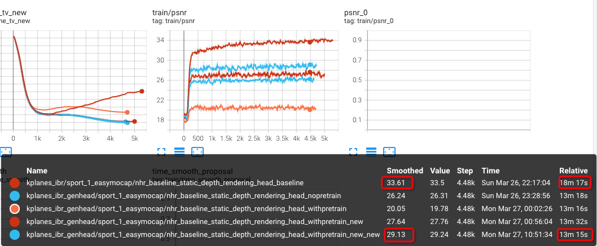

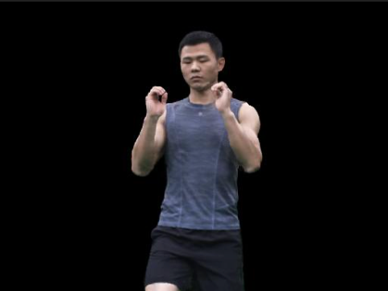
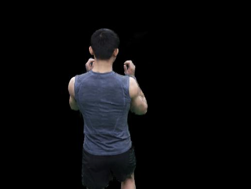
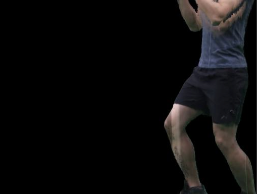
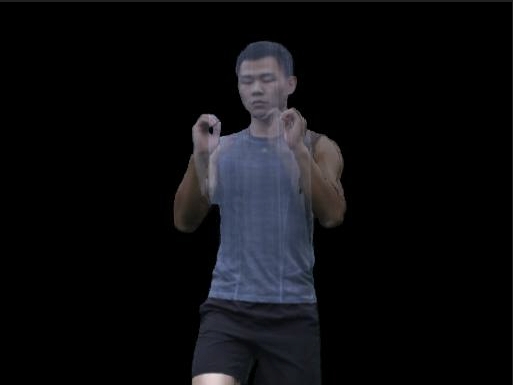
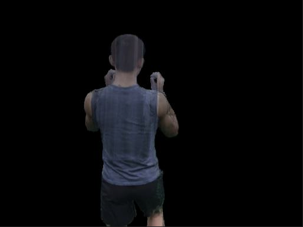
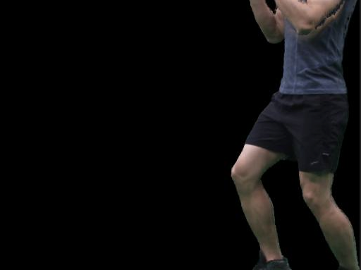
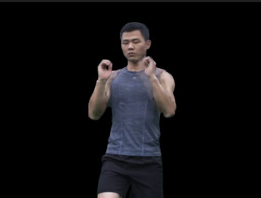
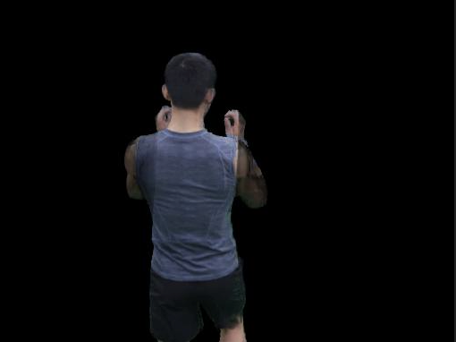

#### 2.2 Possible causes

1. Not enough generalisation ability.
   1. Look at how well ENeRF generalises on this scene.
   2. Solutions:
      1. Quickly fine-tune one frame.
      2. Use a slightly more complex strategy: fine-tune the first n frames, then fine-tune once every 10 frames after that.

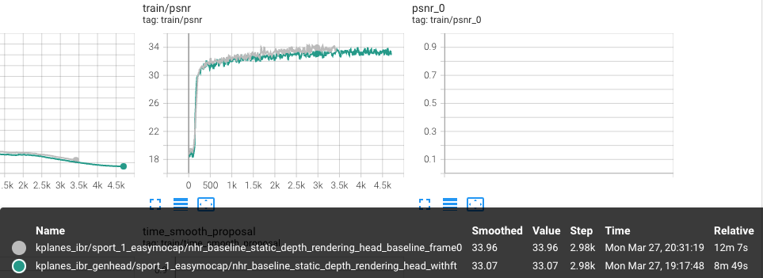
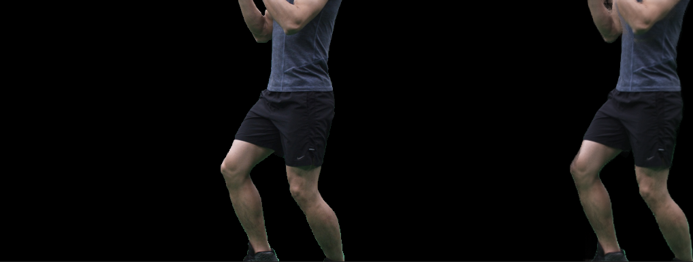
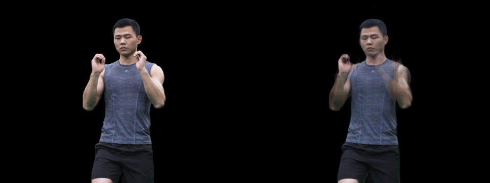
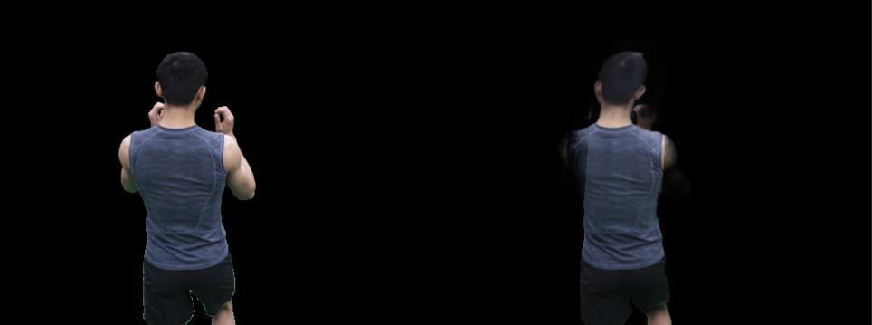
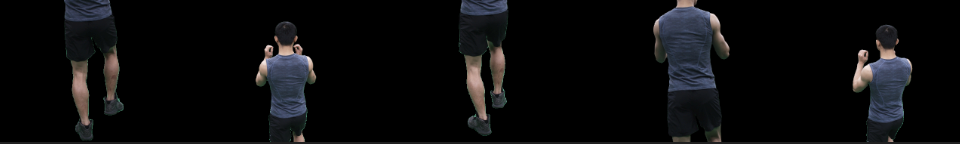
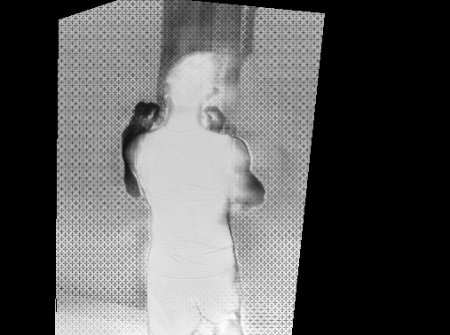
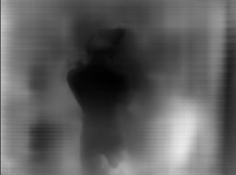

#### 2.3 After replacing with the rendering head fine-tuned on one frame, the results got fairly good

Current problems:

1. Training time is still fairly long.
   1. Many hyperparameters could be explored.
      1. Sampling strategy: [256, 128, 48]
      2. Half precision:
      3. Pixel sampling strategy: use the human body mask.
      4. Compress the geometry representation parameters: no MLP, make the feature grid a bit smaller.
2. The path rendering results have some ghosting.
   1. Cause analysis:
      1. Rendering head
      2. Some other possible starting points:
         1. Why is CNN + IBR head fine?
            1. IBR's training strategy.
            2. Would fine-tuning specifically on the frames that go wrong work?

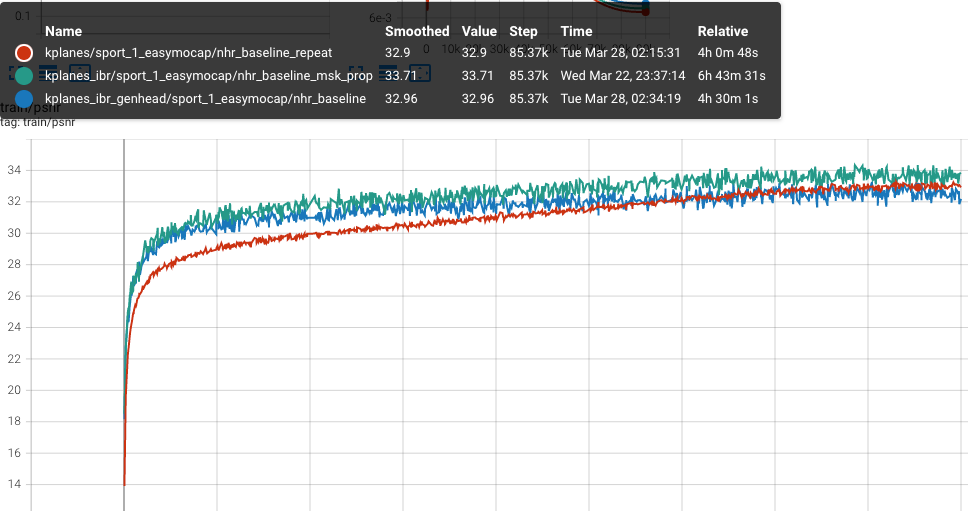

<!-- video not downloadable: step00030000_depth.mp4 -->
<!-- video not downloadable: step00030000.mp4 -->

<!-- video not downloadable: step00060000_depth.mp4 -->
<!-- video not downloadable: step00060000.mp4 -->
<!-- video not downloadable: step00090000_depth.mp4 -->
<!-- video not downloadable: step00090000.mp4 -->

<!-- video not downloadable: step00000000_depth.mp4 -->
<!-- video not downloadable: step00000000.mp4 -->

KPlanes

<!-- video not downloadable: step00030000.mp4 -->

<!-- video not downloadable: step00060000.mp4 -->

<!-- video not downloadable: step00090000.mp4 -->

KPlanes IBR Joint Training

<!-- video not downloadable: step00030000.mp4 -->
<!-- video not downloadable: step00060000.mp4 -->
<!-- video not downloadable: step00000000.mp4 -->
<!-- video not downloadable: step00000000.mp4 -->

<!-- video not downloadable: step00000000.mp4 -->

### 3. Depth sampling

1. Does not work well; possibly it cannot converge once the number of points is reduced.

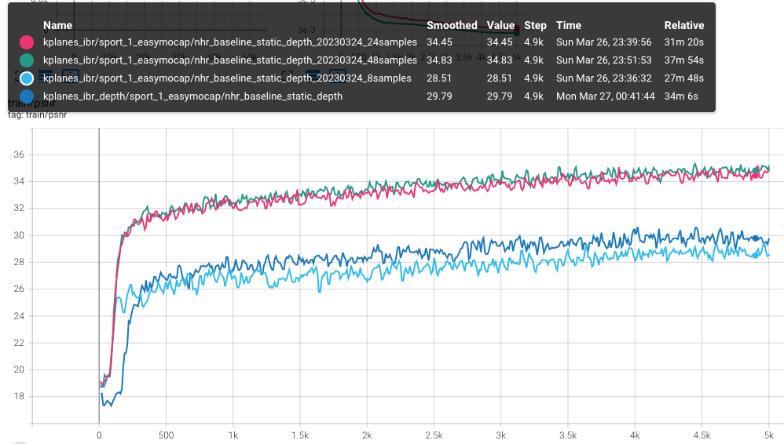
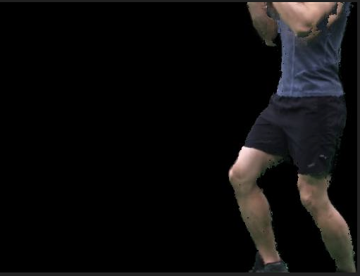
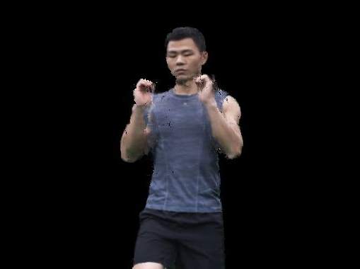

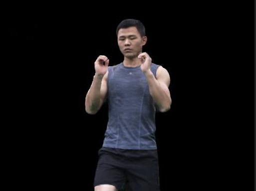
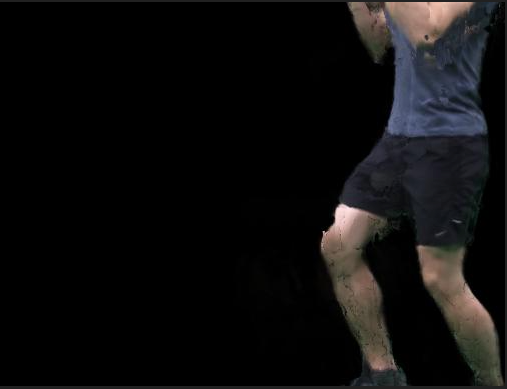

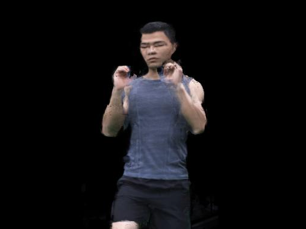

### 4. The current problem is that joint training still has problems

#### 4.1 Current experimental observations:

1. Joint training has flickering.
2. Single-frame joint training also has flickering.
3. The src inp looks fine.
4. It is not caused by random source images.

<!-- video not downloadable: step00000000.mp4 -->
<!-- video not downloadable: step00000000.mp4 -->
<!-- video not downloadable: step00000000.mp4 -->

#### 4.2 Experimental phenomena

#### 4.3 Causes and analysis
