<!--
source: notion page 如何做学术报告slides
source page id: 810f0267-0691-444f-8c94-cc3d5b76dcbc
source fetched: 2026-09-11
status: verified by sonnet, 2026-09-12 (nesting confirmed against the live block tree)
figures: 12, his own reference material, kept as-is
-->

# How to Make Slides for an Academic Talk

> [Original Article](https://pengsida.notion.site/810f02670691444f8c94cc3d5b76dcbc)

> **Translator's note.** The outline below is nested as it is in his live Notion block tree. Notion's export flattens that nesting, so a flat copy of the source will not show it.

> **note** Before making the slides, answer a few questions first:
> 1. Which pieces of work are you going to present? They need to solve problems in the same research direction.
> 2. Which problems in that research direction did these pieces of work solve?
> 3. How do you lead into those problems by introducing related work? (You need to lead into all of the problems at once.)

The line of thinking for academic talk slides:

1. Introduce the research goal.
2. Introduce the applications of the research direction.
3. Introduce the challenges you face by discussing related work (similar to an introduction).
   1. Related work 1.
   2. The challenge related work 1 faces.
   3. Related work 2 solved that challenge.
   4. The new challenge related work 2 faces, which is the challenge the work in this talk solves. Use one slide to present, all together, the technical challenges that the content of this talk solves.
4. Present the content of the talk as a whole.
5. Introduce the first piece of content.
   1. The task setting.
   2. Introduce the challenge faced.
   3. The core idea for solving the problem.
   4. Our method.
   5. Experimental results.
6. Introduce the second piece of content.
7. …
8. Conclusion.
9. An outlook on future work.

Material that needs organizing

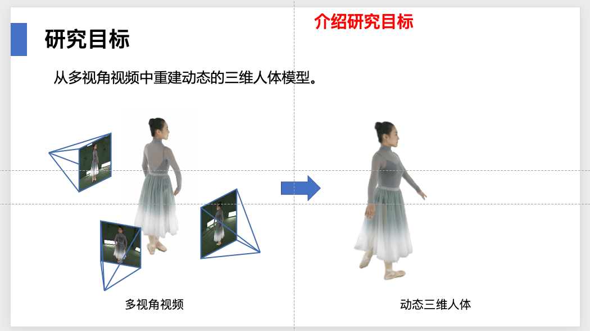

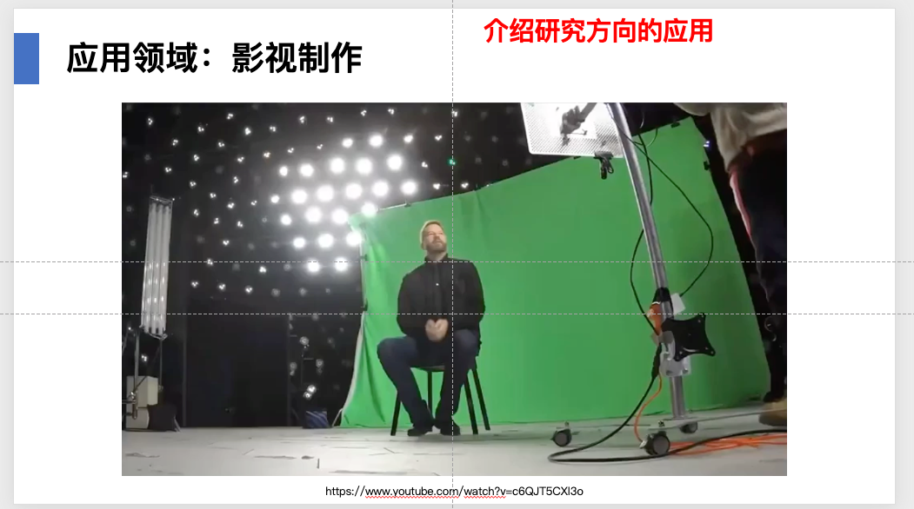

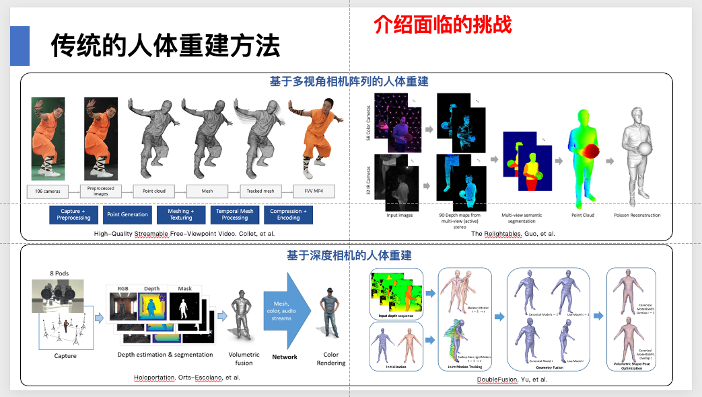

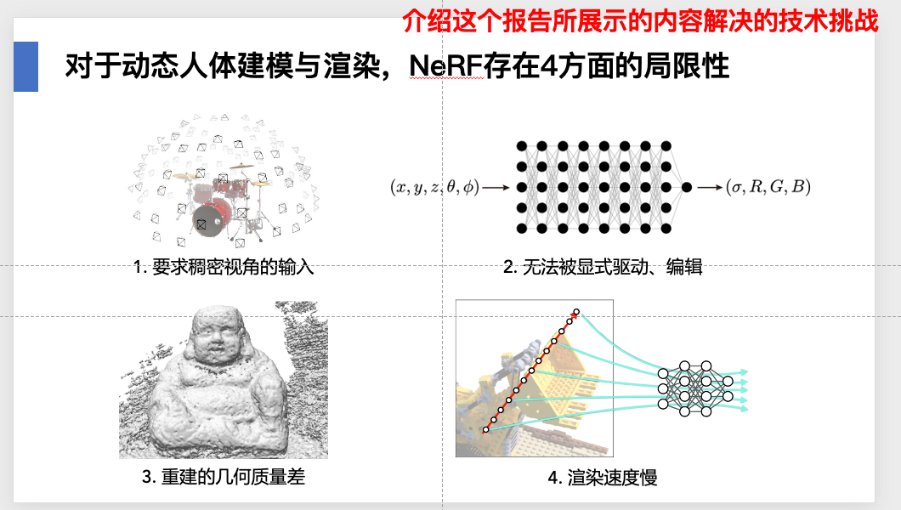

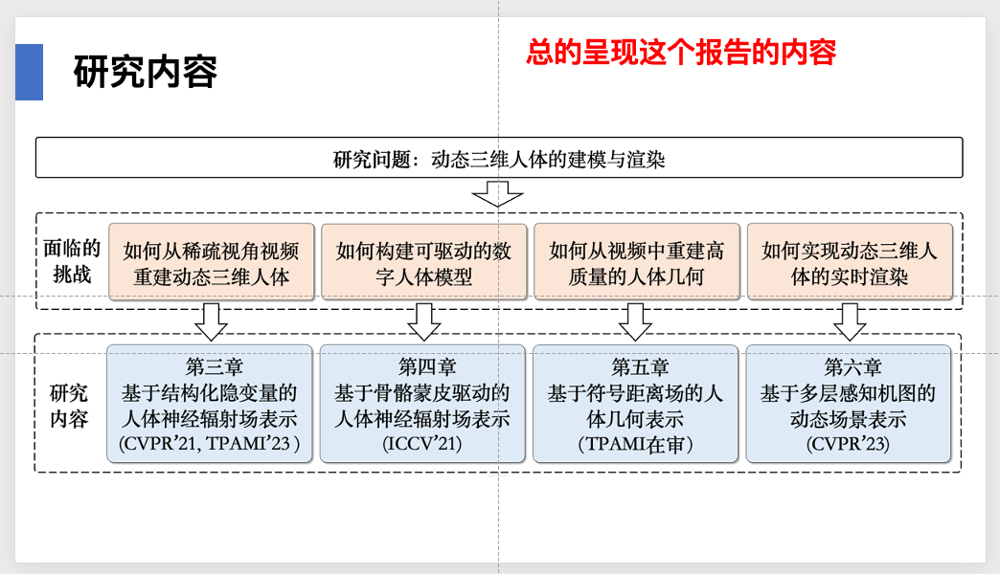

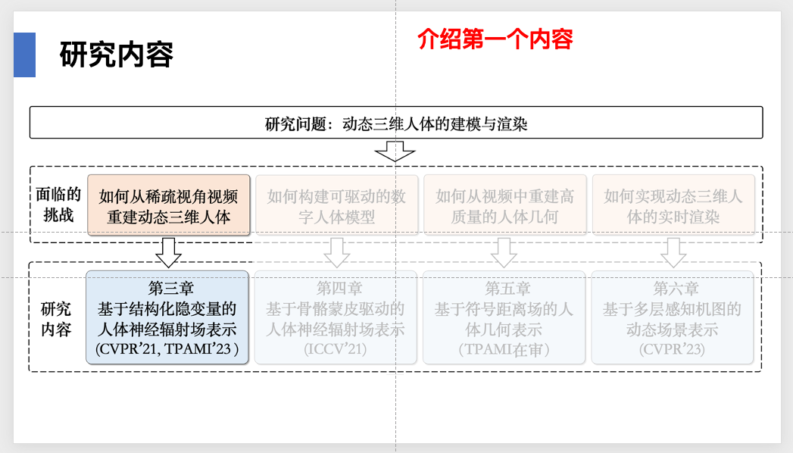

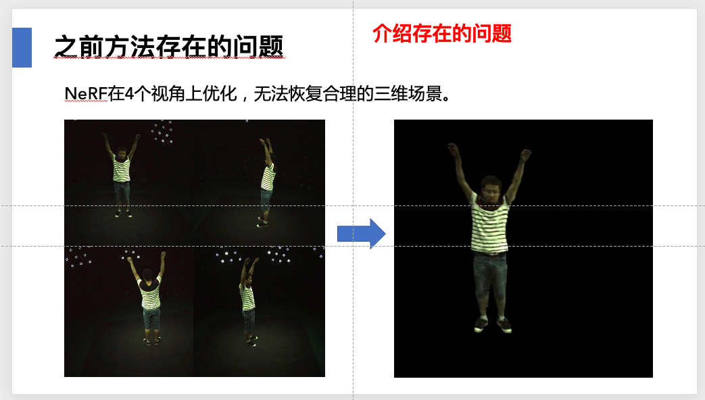

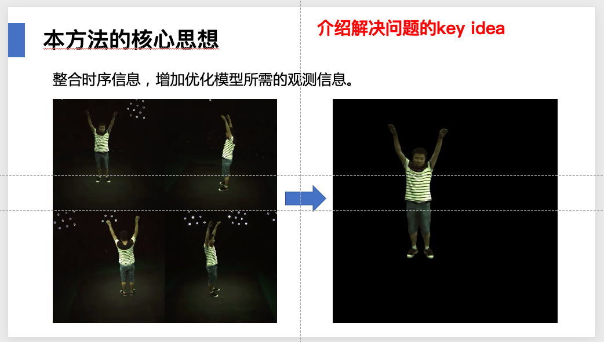

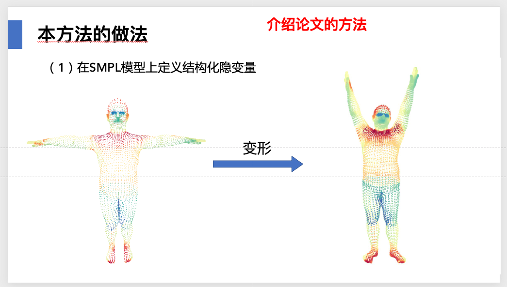

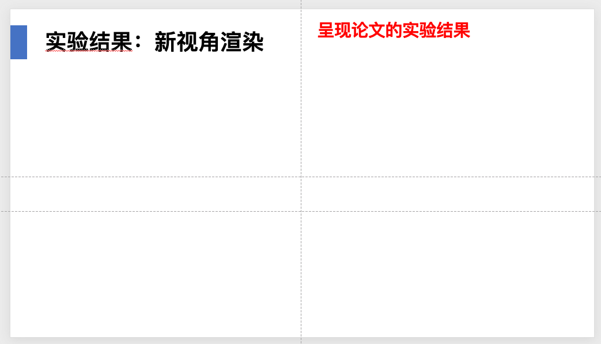

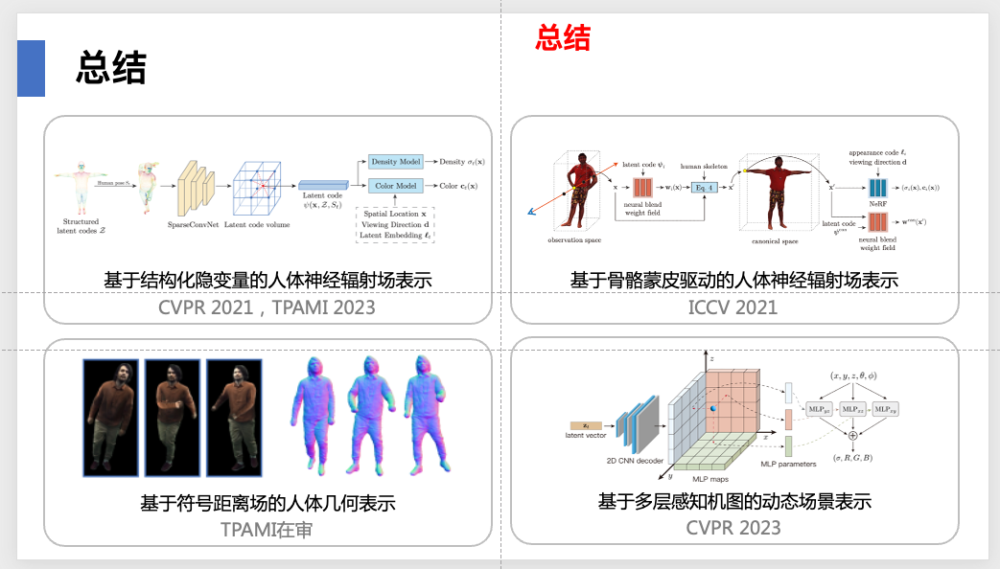

PowerPoint techniques and designing for visual appeal

Learn to use PowerPoint master slides.

Learning PowerPoint: [https://www.notion.so/pengsida/PPT-f1e4f77f0f3943e39dd1210bd3fe71ea](https://www.notion.so/pengsida/PPT-f1e4f77f0f3943e39dd1210bd3fe71ea)

An academic talk slides template: [https://alidocs.dingtalk.com/i/nodes/QOG9lyrgJPwBpdn0u1bOA6m2VzN67Mw4](https://alidocs.dingtalk.com/i/nodes/QOG9lyrgJPwBpdn0u1bOA6m2VzN67Mw4) (a DingTalk mind map. DingTalk's document sharing does not support sharing directly with outsiders, so permission needs to be requested separately.)

Another line of thinking for an academic talk

Start from the application scenario, dig the research goal out of it, then talk about the research content, and finally talk about the scientific problem.

> **note** This differs from talking about the research goal first and then what applications it has.
> The style of this kind of talk focuses on a certain application scenario, then digs the research goal and the research content out of it.

