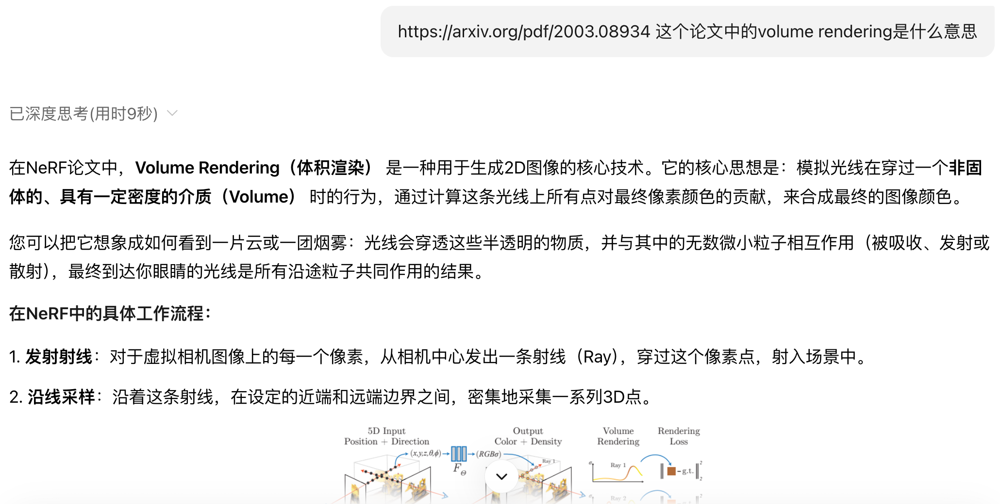
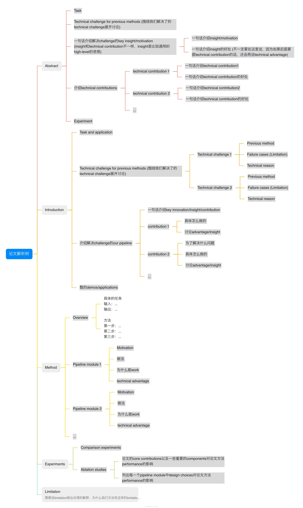
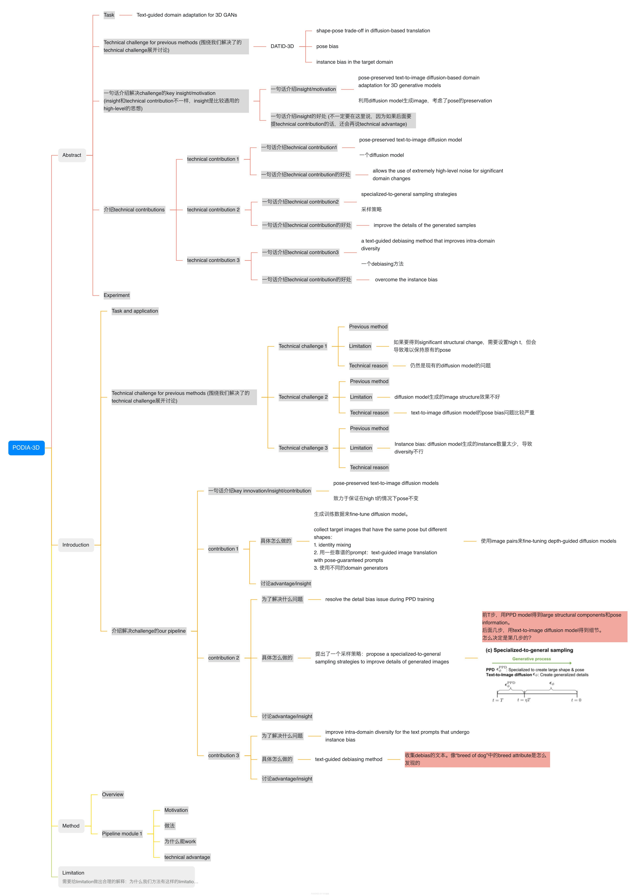

<!--
source: notion page 如何有效地读论文
source page id: d192db87-0bc6-4436-ae4a-4a590b36772a
source fetched: 2026-09-11
status: unverified
figures: 3, screenshots of an AI chat session and of his parsing tree in use, kept as-is
-->

# How to Read Papers Effectively

> [Original Article](https://pengsida.notion.site/d192db870bc64436ae4a4a590b36772a)

> **Translator's note.** The three figures are screenshots in Chinese: an AI chat session used while reading a paper, and his paper parsing tree in use. They are kept as they are, since there is nothing in a tool screenshot worth reconstructing. One of them also contains a figure from the NeRF paper, which is the paper being read in that example.

Some students sometimes feel that "finishing a paper is the same as not having read it". You can use a paper parsing tree to solve this, turning reading a paper into answering questions, and so reading effectively.

How to do it

The paper parsing tree: [https://alidocs.dingtalk.com/i/nodes/mExel2BLV5LaqbQeSx2LpNrAWgk9rpMq](https://alidocs.dingtalk.com/i/nodes/mExel2BLV5LaqbQeSx2LpNrAWgk9rpMq) (a DingTalk mind map. DingTalk's document sharing does not support sharing directly with outsiders, so permission has to be requested separately.)

While reading the paper, use AI to help answer the questions in the paper parsing tree.

As shown in the figures below:

An example of reading a paper with the paper parsing tree

The three levels of reading a paper:

1. The first level, the basic standard: understand every technical detail and every term in the paper. (You may need to read the code to help you understand the paper.)
2. The second level: know what problem this paper is solving. Know why this paper proposes such and such a technique, and why doing it that way is better.
3. The third level: be clear about where this paper sits in the [literature tree](https://pengsida.notion.site/f8b36e484b344a2893a94e4608b72ec2?pvs=25), and think about whether the milestone tasks in the literature tree need updating (the important problems that this research direction needs to solve). Think about this paper's limitations (on what kind of data will failure cases exist? You may need to run experiments to discover the failure cases).

Tools that can help with reading papers:

1. [https://bohrium.dp.tech/home](https://bohrium.dp.tech/home)
2. [https://kimi.moonshot.cn/](https://kimi.moonshot.cn/)
