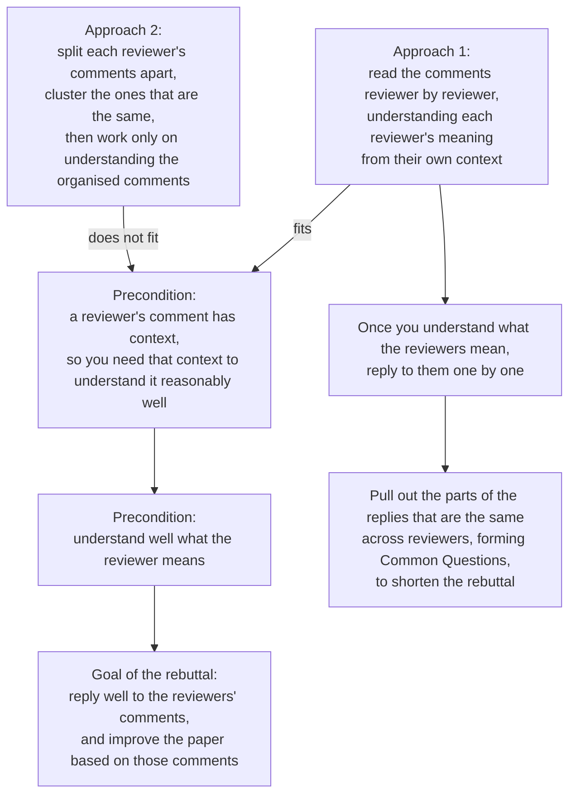

<!--
source: notion page 怎么rebuttal
source page id: af99ce47-103e-4917-b6a5-bd1fd4b3c022
source fetched: 2026-09-11
status: verified by fable, 2026-09-11 (findings applied)
figures: 1, his own flowchart, redrawn in English as Mermaid, original kept
-->

# How to Write a Rebuttal

> [Original Article](https://pengsida.notion.site/af99ce47103e4917b6a5bd1fd4b3c022)

The language style of a rebuttal:

1. Answer what is asked. Do not drag in other things, because that scatters the reviewer's attention.
2. Put the thing the reviewer asked at the very front of the paragraph.
3. As far as possible, answer the reviewer in the order of their questions.
4. As far as possible, list all of a reviewer's questions under that reviewer's section, then reply to them one by one. Even where there are Common Questions, still refer to Common Questions from under the reviewer's section.

For examples of the language style above, see this file:

<!-- Rebuttal语言风格示例.pdf is not downloadable from Notion -->

The concrete rebuttal process:

First, organise the content of the reviews

The newer review-organising tool, based on drawio (recommended, it gives a better overall view and is easier to read):

<!-- Rebuttal整理模板.drawio is not downloadable from Notion -->

His flowchart, redrawn in English. [Original](./assets/3553fe292ff180829544f8223557b369-image.png).

The Excel-based review-organising tool

[https://docs.google.com/spreadsheets/d/1TS2l5SrbExHxA1i_xrm2Sbd5dz_uS4CqAjoAskiZNX0/edit?usp=sharing](https://docs.google.com/spreadsheets/d/1TS2l5SrbExHxA1i_xrm2Sbd5dz_uS4CqAjoAskiZNX0/edit?usp=sharing)

A blank review-organising template:

[https://docs.google.com/spreadsheets/d/17sH8sMqroFrmLKfogcC-9AyJpWKi8Ugru1NoKtFAIDo/edit?usp=sharing](https://docs.google.com/spreadsheets/d/17sH8sMqroFrmLKfogcC-9AyJpWKi8Ugru1NoKtFAIDo/edit?usp=sharing)

> **note** Answer this question clearly: why did the reviewer give this particular score?

Then answer the questions raised in the justification and the weaknesses

These are teaching articles on writing a rebuttal:

[https://deviparikh.medium.com/how-we-write-rebuttals-dc84742fece1](https://deviparikh.medium.com/how-we-write-rebuttals-dc84742fece1) (in English)

[https://research.siggraph.org/blog/guides/writing-a-rebuttal-for-siggraph/](https://research.siggraph.org/blog/guides/writing-a-rebuttal-for-siggraph/) (in English)

> **note** The language style of a rebuttal: answer the reviewer's question head on, so that the reviewer knows on one read which of their questions we are answering.
> The principles to follow generally:
> 1. Whatever the reviewer wants, we give.
> 2. Do not introduce new problems in your answer. (Otherwise it is very easy to be rejected because of it.)

After finishing the first draft of the rebuttal, mark each reviewer's key questions (usually given in the justification), confirm over and over whether you have answered the reviewer's questions correctly and whether it can convince the reviewer. Also ask a fellow student to look at whether you have answered the reviewer's key questions reasonably.

> **note** Why mark only the key questions: because each reviewer generally has only a few points they mainly care about. Some reviewers write a great deal, but once there is that much they cannot remember it themselves either, and forget it after a while. There are one or two key points in the review that they can remember firmly, and those are what they care about most.
> Of course, every question from the reviewer has to be answered well. The point is only that after finishing the first draft of the rebuttal, most of your effort should go on confirming those one or two questions, and you should also ask a few fellow students to confirm whether you have answered them correctly.

