<!--
source: notion page 论文写作模板
source page id: c1a22465a0fa4b15a12985223916048e
source fetched: 2026-09-11
status: unverified
figures: 19, the author's originals, English redraws pending
-->

# A Paper Writing Template

> Collected documents (GitHub repo): https://github.com/pengsida/learning_research

The repository that turns this writing template into Vibe Writing Skills: https://github.com/Master-cai/Research-Paper-Writing-Skills

> **Translator's note.** The LaTeX blocks on this page are his scaffolding, and his comments inside them are translated. The `%% Example:` lines in the source are verbatim sentences and paragraphs taken from published papers. Rather than reprint another author's prose, this translation says what each example slot does and names the paper it came from, so you can read the original sentence at its source. Where a paper could not be identified with confidence, the slot is described without naming one.

<details>
<summary>The paper writing plan diagram</summary>

<!-- the editable 论文写作规划.drawio is not downloadable from Notion; these are its exported pages -->
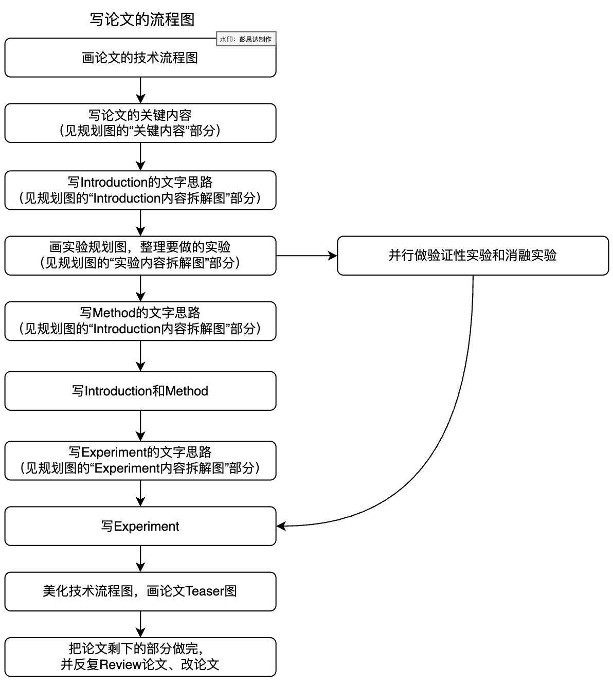
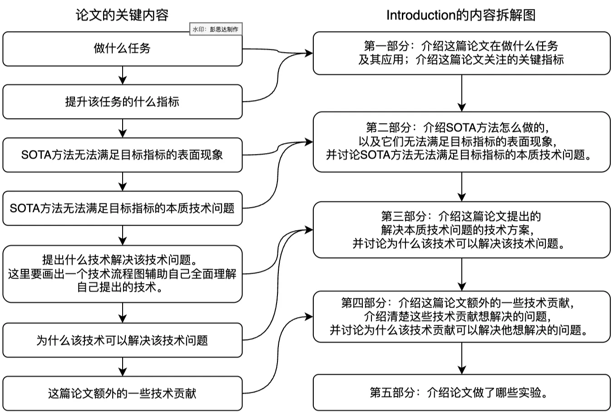
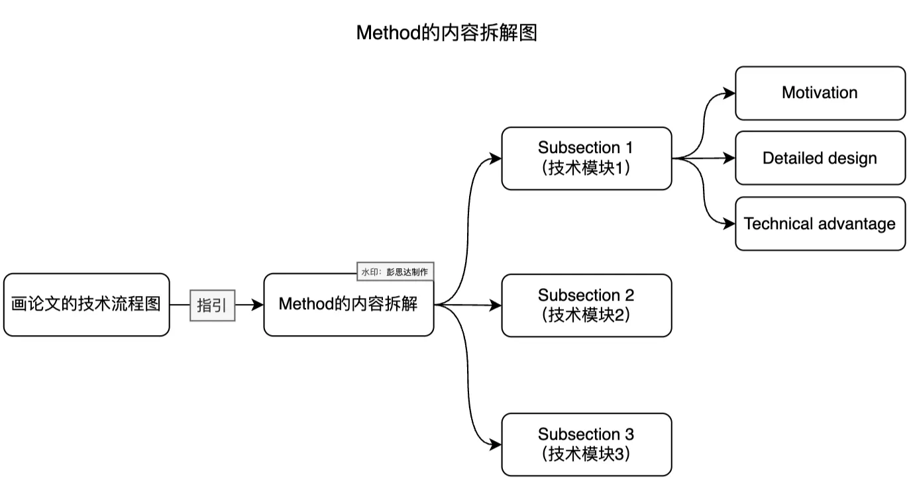
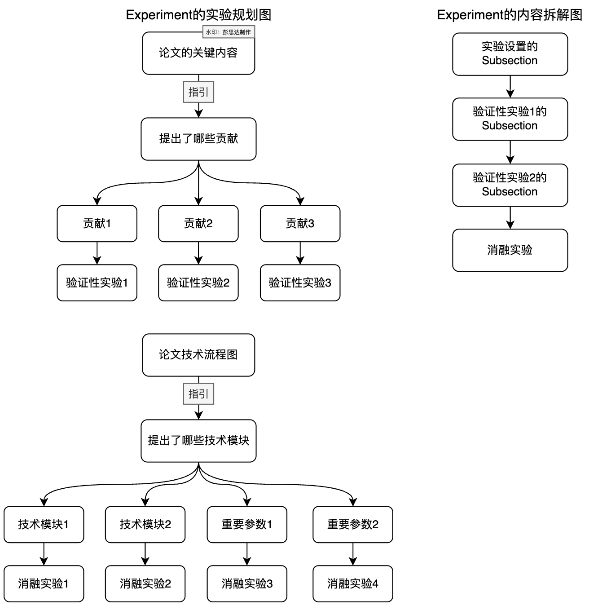

</details>

| Steps for writing a paper | The matching tutorial |
|---|---|
| 1. Sketch a clear pipeline figure | a. Paper figure template (not public) |
| 2. Sort out the paper's story, write an outline for the Introduction, and organise the comparison experiments and ablation studies to run | a. How to sort out a paper's story<br>b. How to write an outline<br>c. How to organise the experiments to run |
| 3. Outline the Method, then write the Method while running experiments | a. How to write the Method<br>b. How to write an outline<br>c. How to use Copilot and GPT to help with English writing |
| 4. Revise the Introduction and Method while running experiments | a. How to revise a paper's writing |
| 5. Once the experiments are mostly done, outline the Experiments, then write it | a. How to write an outline<br>b. How to use Copilot and GPT to help with English writing<br>c. How to draw experiment tables |
| 6. Polish the pipeline figure, draw the teaser figure | a. Paper figure template (not public) |
| 7. Outline the Related work, then write it | a. How to write Related work<br>b. How to write an outline<br>c. How to use Copilot and GPT to help with English writing |
| 8. Review the paper. Revise its Introduction, Method and Experiments | a. How to review a paper<br>b. How to revise a paper's writing |
| 9. Outline the Abstract, then write it | a. How to write an Abstract<br>b. How to write an outline<br>c. How to use Copilot and GPT to help with English writing |
| 10. Choose the paper title | a. How to choose a paper title |
| 11. Review and revise the paper, again and again | a. How to review a paper<br>b. How to revise a paper's writing |

> **note**
> The key to a paper getting good reviews: make the paper beautiful and well presented, so the first impression is that this paper is high class.
> How to make a paper look beautiful and high class at first glance:
> 1. A good-looking teaser figure and pipeline figure.
> 2. Good-looking tables and result figures.
> 3. Tidy typesetting.

> **note** Principles for writing a paragraph:
> 1. One paragraph says one Message, and says it clearly. Do not blend several Messages together.
> 2. The first sentence of a paragraph must tell the reader what the paragraph is about. (The pyramid principle: the tip of the pyramid is the point you want to convey, the base is the logical evidence supporting it.)

The basic approach to writing in English: first write the outline, then refine the thinking for each part, then write the actual English sentences. Pay attention to the flow between paragraphs and between sentences. (For what flow means, see that document.)

Writing a paper must be done "as if cutting, as if grinding, as if carving, as if polishing": taste it over and over, and work out whether the reader can understand it.

The ability to "self-review whether your paper's writing is clear" matters a great deal. You can only know what to fix once you know there is a problem.

<details>
<summary>The keys to writing a paper</summary>

1. Get the outline clear, then start writing.
2. As if cutting, as if grinding, as if carving, as if polishing: revise the outline and the English sentences over and over.


</details>

<details>
<summary>How to judge whether a paper's paragraph is written clearly (important)</summary>

<!-- does-my-writing-flow.pdf is not downloadable from Notion -->

1. Read the paragraph from the reader's point of view. Several things can be checked:
   1. Does this paragraph have one clear theme?
   2. Does the first sentence of the paragraph make clear what the paragraph is about?
   3. Can the reader understand every noun (every concept) in the sentences? Is it self-contained?
      <details>
      <summary>When will a reader fail to understand a noun in a sentence</summary>

      (empty in the source)

      </details>
   4. Is the logic between two sentences continuous?
      <details>
      <summary>When is the logic between two sentences not continuous</summary>

      (empty in the source)

      </details>
   5. Reverse-outlining. From the paragraph you have already written, list its outline, and see whether the thinking runs smoothly.

</details>

How to use Copilot and GPT to help with English writing (important, a basic skill in the age of LLMs)

How to revise a paper's writing

> **note** When to start writing the paper: normally, start at least one month before the deadline.

<details>
<summary>The key time points for writing a paper (plan from one month before the deadline)</summary>

One month before the deadline, the method is probably not fully settled and the experiments are not all finished. But the paper's story is basically settled, so you can start writing and start planning what to do.

> **note** Writing the paper a month early saves time later, makes the whole thing easier on yourself, and helps you think about which experiments to run.

| What to write | Time point |
|---|---|
| 1. Organise the existing story, including the core contribution, each module of the method and its motivation.<br>2. List the comparison experiments and ablation studies to run.<br>3. Write a first draft of the introduction this week. | Four weeks before the deadline |
| Ideally settle the method this week.<br>1. Draw the pipeline figure sketch clearly and settle it.<br>2. Once the pipeline figure is confirmed, write a first draft of the method. At minimum the method's frame is settled this week, so the method can be started. If the details of the method are not settled, write `\todo{}` in the matching places and leave them for now, but at least get the frame of the method written.<br><br>By the end of this week, the first drafts of the introduction and method must go to your advisor, otherwise your advisor probably cannot finish revising the paper. (Imagine your advisor starting to revise ten very incomplete papers in the last few days. What kind of hellish experience is that? If you faced that yourself, how would you feel?) | Three weeks before the deadline |
| Write first drafts of the experiments, abstract and related work this week. | Two weeks before the deadline |
| Revise the paper, polish the pipeline figure and the teaser, make the demo. | The last week before the deadline |

<details>
<summary>Managing projects with a submission progress table</summary>

Record the lab's overall submission progress, so you know how many papers still need revising, and can therefore know at which point your advisor will not be able to finish revising them.

| Method | Introduction | Project lead | Related work | Experiments | Abstract |
|---|---|---|---|---|---|
| describe the specific progress | xxx | | | | |
| xxx | | | | | |
| xxx | | | | | |
| xxx | | | | | |
| xxx | | | | | |

</details>

</details>

<details>
<summary>The paper title</summary>

The title matters, because different titles may well attract reviewers from different fields.

Before choosing a title, first write down some important keywords, then choose the title based on those keywords.

The title and the phrase naming the paper's method must have concrete meaning and be informative, so that readers remember them easily. Informative includes: the technique used, the paper's task, the problem the paper solves.

</details>

<details>
<summary>Abstract</summary>

> **note** How to write a good abstract: (1) Think through the abstract's outline. (2) Fill in the template below. (3) Revise the abstract over and over.

The key is to answer each of the following questions before writing:

1. What technical problem do we solve, and why is there no well-established solution to it (important).
2. What is our technical contribution.
3. What is the fundamental reason our method works.
4. What is our method's technical advantage, and what is our new insight (important).

<details>
<summary>Version 1: introduce the technical challenge, then the technical contribution that solves it in one or two sentences</summary>

```latex
\section{Abstract}
% Task
% Technical challenge for previous methods (discuss around the technical challenge that we solved)
% One or two sentences on the technical contribution that solves the challenge. Normally you just name the technique, without walking through each step. That name has to be understandable, with no sense of a jump. This ability matters a lot for writing a good abstract.
% Introduce the benefit of the technical contribution
% Experiment
```

</details>

<details>
<summary>Version 2: introduce the technical challenge, then one or two sentences on the insight that solves it, then one sentence on the technical contribution that realises the insight. (I personally recommend this one)</summary>

```latex
\section{Abstract}
% Task
%% Example: a diffusion-model paper opens by saying generative models have advanced through the success of diffusion models.
%% Example: Neural Body (Peng et al., CVPR 2021) opens by naming its task, novel view synthesis of a human performer from very sparse camera views.

% Technical challenge for previous methods (discuss around the technical challenge that we solved)
%% Example: the same diffusion paper credits guidance techniques for the progress, then states the limitation, that they cannot guide a generated image to be aware of its geometric configuration.
%% Example: Neural Body notes that implicit neural representations give remarkable view synthesis given dense views, then states that the learning becomes ill-posed when views are highly sparse.

% One sentence on the insight that solves the challenge
%% Example: the diffusion paper proposes guidance using depth estimated from the model's own internal representations.
%% Example: Neural Body states its key idea in one line, integrating observations over video frames.

% One or two sentences on the technical contribution that realises the insight. Normally you just name the technique, without walking through each step. That name has to be understandable, with no sense of a jump. This ability matters a lot for writing a good abstract.
%% Example: the diffusion paper names a label-efficient depth estimation framework, then two guidance techniques used at sampling time.
%% Example: Neural Body names its contribution, a human body representation whose per-frame neural representations share one set of latent codes anchored to a deformable mesh.

% Introduce the benefit of the technical novelty
%% Example: Neural Body follows the contribution with what it buys, that observations across frames integrate naturally and the deformable mesh gives geometric guidance for more efficient learning.

% Experiment
```

</details>

<details>
<summary>Version 3: there are several technical contributions, so describe each contribution together with its technical advantage</summary>

```latex
% Task
%% Example: deep snake (Peng et al., CVPR 2020) names its contour-based approach for real-time instance segmentation, then contrasts it with methods that directly regress boundary point coordinates.

% One sentence on the technical contribution and its technical advantage (this ability matters a lot for writing a good abstract.)
%% Example: deep snake describes iteratively deforming an initial contour with a network, framed as the classic snake idea done in a learning-based way.

% One sentence on the technical contribution and its technical advantage
%% Example: deep snake introduces circular convolution, and states the advantage over generic graph convolution, that it better exploits the cycle-graph structure of a contour.

% One sentence on the technical contribution and its technical advantage
%% Example: deep snake presents its two-stage pipeline, initial contour proposal then contour deformation, and states what it buys, handling errors in object localisation.

% Experiment
```

</details>

</details>

<details>
<summary>Introduction</summary>

> **note** How to write a good introduction: (1) Think through the introduction's outline. (2) Fill in the template below. (3) Revise the introduction over and over.

How to think through the introduction's outline: reason backwards, then reason forwards.

First reason backwards, answering each of these questions.

1. What technical problem do we solve, and why is there no well-established solution to it (important).
2. What are the contributions of our pipeline (for example, proposing a new and valuable task, proposing a new and valuable technical metric, proposing a new technical problem, proposing a new technique).
3. What is the benefit of our contributions, why do they solve this technical challenge, and what new insight do they bring (important).
4. How do we lead into the technical challenge we solved, and into our new insight, by writing about previous methods.

Then reason forwards, listing the paper's story:

1. Introduce the paper's Task.
2. Lead into the technical challenge we solved by discussing previous methods.
3. To solve this technical challenge, we propose xx contributions.
4. What is the technical advantage of our contributions, expressing our new insight (important).

```latex
\section{Introduction}
% Task and application
% Technical challenge for previous methods (discuss around the technical challenge that we solved. The technical challenge includes the limitation and the technical reason)
% Introduce our pipeline that solves the challenge
% Experiment
% Contributions
```

<details>
<summary>Introducing the Task and application</summary>

<details>
<summary>Version 1: the Task is fairly niche, so introduce the Task first, then the Application</summary>

```latex
% Introduce the Task (if the task is very familiar, this can be skipped)
%% Example: an object pose estimation paper states the task as estimating an object's orientation and translation relative to a canonical frame from a single image.
[xxx task] targets at recovering/reconstructing/estimating [xxx output] from [xxx input].

% Introduce the Application
%% Example: the same paper names augmented reality, autonomous driving and robotic manipulation as applications.
[xxx task] has a variety of applications such as [xxx], [xxx], and [xxx].
```

</details>

<details>
<summary>Version 2: everyone is fairly familiar with the Task, so introduce the Application directly</summary>

```latex
% Introduce the Application
%% Example: the same pose estimation paper's application sentence, naming augmented reality, autonomous driving and robotic manipulation.
[xxx task] has a variety of applications such as [xxx], [xxx], and [xxx].
```

</details>

<details>
<summary>Version 3: introduce the application of the general task first, then the specific task setting. (When the setting is fairly new, I personally recommend this one)</summary>

```latex
% Introduce the application of the general task
%% Example: the same application sentence as above.
[xxx task] has a variety of applications such as [xxx], [xxx], and [xxx].

% Introduce the specific task setting
%% Example: a 6DoF pose paper narrows to its specific setting, recovering rotation and translation in 3D from a single RGB image of the object.
This paper focuses on the specific setting of recovering/reconstructing/estimating [xxx output] from [xxx input].
```

</details>

<details>
<summary>Version 4: everyone is fairly familiar with the Task, so introduce the Application directly. Then, in the paper's opening paragraph, lead into the technical challenge you want to solve (the failure cases you want to solve, the task metric you want to improve) by introducing previous methods</summary>

> **note** Personally I feel it is quite good for the first paragraph of the introduction to state clearly what you want to solve, rather than taking several paragraphs of previous methods to lead into the technical challenge.

But the situation has to suit it, and that is fairly rare. Usually you need several paragraphs of previous methods to lead into the technical challenge.

Introduction writing that suits version 4:

First part (introduce the task and application. Lead directly into the technical challenge by introducing previous methods 1)
→ second part (previous methods 2 try to solve this challenge, but have problems)
→ third part (our method)

Introduction writing in the normal case:

First part (introduce the task and application)
→ second part (previous methods 1, but they have xx limitation)
→ third part (previous methods 2, but they have xx limitation. Only here is the technical challenge we want to solve brought out)
→ fourth part (our method)

```latex
% The opening paragraph of ManhattanSDF's introduction
% The opening paragraph of Deep Snake's introduction

% Introduce the Application
%% Example: ManhattanSDF (Guo et al., CVPR 2022) opens by calling multi-view 3D scene reconstruction a cornerstone of applications, naming augmented reality, robotics and autonomous driving.
%% Example: deep snake (Peng et al., CVPR 2020) opens by calling instance segmentation a cornerstone of tasks needing both accuracy and efficiency.

% Lead into the technical challenge you want to solve by introducing previous methods
%% Example: ManhattanSDF describes the traditional per-image depth then fusion pipeline, then states the limitation, difficulty on low-textured regions such as indoor floors and walls, with the cause, unreliable stereo matching there.
%% Example: deep snake describes segmenting pixel-wise inside a detector's bounding box, then gives two costs, sensitivity to an inaccurate box and expensive post-processing from dense binary pixels.
```

</details>

</details>

<details>
<summary>Introducing the Technical challenge for previous methods (this part is very important. Discuss it around the technical challenge that we solved. The purpose is to make the reader curious about how to solve this technical challenge, and to make them see the motivation and the benefit of the method we propose)</summary>

> **note** The key is to think through the logic of "leading into the technical challenge we solved" before writing.

For an existing task where methods already exist, the approach is to think each of these through:

1. What technical challenge does our pipeline solve.
2. Which method [recent method 2] has this technical challenge.
3. Why does recent method 2 exist. Usually to solve the technical challenge of some method [recent method 1]. (This question is optional. There may be only one recent method, or several.)
4. Why does recent method 1 exist. Usually to solve the technical challenge of some [traditional method].

For a novel task, the approach is to think each of these through:

1. Think through the technical challenge our pipeline solved.

> **note** Do not first write a naive solution and then write our improvement on that naive solution. That makes it easy for people to think our method is a 4-out-of-10 improvement piece. Adding things bit by bit this way is easy for the reader to follow, but it also makes the reader smugly assume the idea was straightforward to come up with. What they may not realise is that it is our way of writing that led them there, which is why it came easily. This kills the reader's curiosity about solving the technical challenge.

Even if our work really is a 4-out-of-10 piece, do not write it this way.

<details>
<summary>Version 1: existing task, methods already exist.</summary>

```latex
% Discuss the general technical challenges of this task (used to lead into recent methods)
%% Example: a pose estimation paper lists what makes the problem challenging, occlusion, lighting and appearance variation, and cluttered background.
%% Example: a human capture paper points to the inherent ambiguity of acquiring geometry, materials and motion from images.
This problem is particularly challenging due to several factors, including [xxx reason], [xxx reason], and [xxx reason].

% One or two sentences introducing a class of traditional methods, then discuss the technical challenge they face (if traditional methods exist, discuss them, to show we know this field well)
%% Introduce the traditional method
%% Example: a pose paper notes that traditional methods establish correspondences between the object image and the object model.
To overcome these challenges, traditional methods [describe what they do], [what they achieve].

%% Discuss the technical challenge they face
%% Example: the same paper states that they rely on hand-crafted features, which are not robust to image variation and background clutter.
However, they [the technical challenge they face].

% One or two sentences introducing a class of recent methods 1, then discuss the technical challenge they face (optional. Lead into the technical challenge by discussing what they do. Discuss several recent methods if that helps lead into the technical challenge.)
%% Introduce recent methods 1
%% Example: the same paper describes end-to-end networks that take an image and output its pose.
Recently, [xxx methods] [describe what they do], [what they achieve].

%% Discuss the technical challenge they face (introduce the limitation and the technical reason)
%% Example: the same paper states that generalisation remains an issue, because it is unclear such end-to-end methods learn sufficient feature representations.
However, they [the limitation], because [xxx technical reason].

% One or two sentences discussing a class of recent methods 2, then discuss the technical challenge they face (this needs to lead into the technical challenge we solved)
%% Introduce recent methods 2
%% Example: PVNet-style work describes regressing 2D keypoints with a CNN then solving pose with PnP, framing the keypoints as an intermediate representation, and credits robust keypoint detection for state-of-the-art performance.
To overcome this challenge, [xxx methods] [describe what they do], [what they achieve].

%% Discuss the technical challenge they face (introduce the limitation and the technical reason)
%% Example: the same work states the difficulty with occluded and truncated objects, since some keypoints are invisible, and notes that memorising similar patterns still generalises poorly.
However, they [the limitation], because [xxx technical reason].
```

</details>

<details>
<summary>Version 2: existing task, methods already exist, and the insight behind our technical contribution has been used in traditional methods.</summary>

```latex
% Introduce what a class of traditional/recent methods does, and discuss the technical challenge they face (in order to lead into our insight)
%% Introduce what a class of traditional/recent methods does
%% Example 1, deep snake: segmenting pixel-wise inside a detector's bounding box.
%% Example 2, ManhattanSDF: per-image depth from multi-view stereo, then fusion into 3D models.
Traditional/recent methods [describe what they do], [what they achieve].

%% Discuss the technical challenge they face (introduce the limitation and the technical reason)
%% Example 1, deep snake: sensitivity to an inaccurate box, plus costly post-processing from dense binary pixels.
%% Example 2, ManhattanSDF: successful in most cases, but difficulty on low-textured regions such as indoor floors and walls, because stereo matching is unreliable there.
However, they [the limitation], because [xxx technical reason].

% Discuss the traditional methods that used our insight (discuss a traditional method for the same task with a similar technique, implying our proposed technique has traditional methods backing it)
%% Example 1, deep snake: presents the object contour as an alternative shape representation, notes it is not confined to a bounding box and has fewer parameters, and traces it to the seminal snakes or active contours work.
%% Example 2, ManhattanSDF: presents the planar prior of man-made scenes as the typical approach, long explored, with the Manhattan-world assumption as the renowned example.

%% Introduce the insight
To overcome this problem, a typical approach is [xxx insight], which has long been explored in literature.

%% Introduce what a class of traditional methods does
These methods [describe what they do].

%% Discuss the technical challenge they face (introduce the limitation and the technical reason)
%% Example 1, deep snake: many variants exist, but they are prone to local optima because the objective functions are handcrafted and typically nonconvex.
%% Example 2, ManhattanSDF: they optimise per-view depth maps rather than the full 3D scene model, so depth and plane segmentation stay inconsistent across views, with a forward reference to its own experiments.
However, they [the limitation], because [xxx technical reason].

% One or two sentences discussing a class of recent method 2, then discuss the technical challenge they face (this needs to lead into the technical challenge we solved)
%% Introduce recent method 2
%% Example: ManhattanSDF describes the trend of implicit neural representations learned with differentiable renderers, names the SDF-based works and their rendering schemes, and credits well-defined surfaces for high-quality geometry.
To overcome this challenge, [xxx methods] [describe what they do], [what they achieve].

%% Discuss the technical challenge they face (introduce the limitation and the technical reason)
%% Example: ManhattanSDF states that they rely on multi-view photometric consistency, so they still do poorly in low-textured planar regions, with a figure reference, because many plausible solutions satisfy the photometric constraint there.
However, they [the limitation], because [xxx technical reason].
```

</details>

<details>
<summary>Version 3: novel task, no existing methods.</summary>

Example 1, example 2

```latex
% To achieve xx goal, several requirements must be met (or several challenges are faced).
%% Example: a single-image object intrinsics paper states its goal, then says the problem is challenging for three reasons.

% Describe the first point
%% Example: it has only a single image, which separates it from 3D-aware generative models trained on thousands of instances, leaving the inference problem highly under-constrained.

% Describe the second point
%% Example: the few instances vary a lot in pixel values because pose and illumination differ and are neither annotated nor known, and structure-from-motion tools do not apply because appearance variation violates their assumptions.

% Describe the third point
%% Example: the object intrinsics being inferred are probabilistic rather than deterministic, so the goal is a distribution over geometry, texture and material.
```

</details>

</details>

<details>
<summary>Introducing our pipeline that solves the challenge</summary>

> **note** The key is to answer the following questions before writing.

Version 1, for an existing task where methods already exist, the approach is to think each of these through:

1. What technical challenge does our pipeline solve.
2. What is our technical contribution.
3. What is the fundamental reason our method works.
4. What is the benefit of our method relative to previous methods.

Version 2, for a novel task, the approach is to think each of these through:

1. What technical challenge does our pipeline solve.
2. What is our technical contribution.
3. What is the fundamental reason our method works.

<details>
<summary>Version 1: one contribution, and that contribution has several advantages. There is a teaser figure introducing the basic idea of our method.</summary>

```latex
% In this paper, we propose a novel framework …
%% Example: Neural Body introduces its representation by name, for dynamic humans, to solve novel view synthesis from sparse views.
In this paper, we propose a novel framework/representation, named [method name] for [xxx task].

% Draw a teaser introducing the basic idea
%% Example: one sentence pointing at the figure that illustrates the basic idea.
The basic idea is illustrated in [xxx Figure].

% One sentence introducing our key novelty/contribution (this ability matters a lot for writing a good introduction. You have to introduce our key idea clearly in one or two sentences, so the reader can understand what we are saying.)
%% Example: Neural Body contrasts learning the per-frame implicit fields separately against generating them from one shared set of latent codes.
Our innovation is in [one sentence introducing our key novelty].

% Say what is actually done
%% Example: Neural Body anchors latent codes to the vertices of a deformable human model, transforms the code locations by the human pose, then regresses density and colour for any 3D point from those codes, learning codes and network jointly across all frames.
Specifically, [say what is actually done].

% Introduce our method's advantage (what is the fundamental reason it works, what is the benefit relative to previous methods.)
%% Example: Neural Body credits the latent variable model in statistics as its inspiration, which is what lets it integrate observations across frames.
In contrast to previous methods, [our method's advantage].

% Introduce another advantage
%% Example: Neural Body names the deformable model's geometric prior, a rough surface location, as enabling more efficient learning of implicit fields.
Another advantage of the proposed method is that [our other advantage].
```

</details>

<details>
<summary>Version 2: two contributions, with a teaser figure introducing the basic idea of our method.</summary>

```latex
% In this paper, we propose a novel framework …
%% Example: the Neural Body opening sentence again.
In this paper, we propose a novel framework/representation, named [method name] for [xxx task].

% One sentence introducing our key novelty/contribution
%% Example: DreamBooth (Ruiz et al., CVPR 2023) states representing a subject with a rare token identifier and fine-tuning a diffusion text-to-image framework that works in two steps, low-resolution generation then super-resolution.
Our innovation is in [one sentence introducing our key novelty].

% Draw a teaser introducing the basic idea
% Example: one sentence pointing at the figure.
The basic idea is illustrated in [xxx Figure].

% Say what is actually done
%% Example: DreamBooth describes fine-tuning the low-resolution model with the input images and prompts containing a unique identifier followed by the subject's class name.
Specifically, [say what is actually done].

% Introduce our method's advantage (what is the fundamental reason it works, what is the benefit relative to previous methods.)
%% Example: the Neural Body latent-variable-model sentence again.
In contrast to previous methods, [our method's advantage].

% Introduce another technical contribution (usually to solve the technical challenge that contribution 1 faces, otherwise the two contributions feel loosely connected)

%% Discuss the other technical challenge
%% Example: DreamBooth names overfitting and language drift, which make the model tie the class name to the specific instance.
However, [describe the other technical challenge].

%% Describe what technical contribution 2 actually does
%% Example: DreamBooth proposes a class-specific prior preservation loss that uses the class prior embedded in the model to encourage diverse instances of the same class.
Specifically, [say what is actually done].
```

</details>

<details>
<summary>Version 3: based on a previous method's pipeline, propose a new module. There is a teaser figure introducing the basic idea of our method.</summary>

```latex
% deep snake's opening sentence, naming a learning-based snake algorithm for real-time instance segmentation.

% The sentence crediting previous methods, taking an initial contour as input and deforming it by regressing vertex-wise offsets.

% The one-sentence innovation, introducing circular convolution for efficient feature learning on a contour, with a figure reference.

% The observation sentence, that a contour is a cycle graph of vertices in a closed cycle, and since every vertex has degree two, standard 1D convolution applies to the vertex features.

% The mechanism sentence, that because the contour is periodic, circular convolution convolves an aperiodic 1D kernel with a periodic function in the standard way.

% The advantage paragraph, that the kernel encodes both each vertex's feature and the relationship among neighbouring vertices, contrasted against generic GCN pooling, framed as a learnable aggregation function, with a forward reference to its own experiments.
```

</details>

<details>
<summary>Version 4: our contribution comes from an important observation.</summary>

Introduce the key innovation first, then discuss an observation that anyone can understand as soon as they hear it (as our method's motivation), then describe our specific method, and finally discuss the benefit of our method.

```latex
% Same as version 3: deep snake's opening sentence.

% The one-sentence innovation with its figure reference.

% The observation sentence about the cycle graph and degree-two vertices.

% The mechanism sentence about periodicity and circular convolution.

% The advantage paragraph contrasting the learnable aggregation function against generic GCN pooling, with the forward reference to its experiments.
```

</details>

<details>
<summary>Not recommended</summary>

<details>
<summary>The method is fairly simple, and you do not intend to explain your approach clearly in the introduction. You only discuss insights and the approach in the abstract, to make the reviewer feel our method is quite novel. (Generally not recommended. You should aim to explain clearly in the introduction how the core contribution actually works.)</summary>

> **note** The skill in this template is how to make a simple pipeline sound novel. Note, it is not about making the insight sound novel, it is about making the pipeline steps sound novel.

```latex
% The opening sentence proposing a 3D GAN training method for photo-realistic images irrespective of viewing angle.

% Introduce the key idea
% The key idea sentence, casting a hard problem into two subproblems that are each easier to solve.

% Explain why the key idea works, but without discussing the pipeline concretely. (Or introduce the benefit of the key idea)
%% Example: the paper splits the problem into two discrimination problems, real-or-not and agrees-with-camera-pose, then argues each subproblem is much easier than learning a per-pose real image distribution or learning pose estimation.

% Introduce the pipeline module, but using some new concepts and terms, without making clear how the whole pipeline actually works. (Or do not introduce the concrete pipeline at all)
%% Example: it proposes a dual-branched discriminator with one branch for photorealism and one for pose consistency, and states the outcome without saying how it is done.

% Introduce another contribution
%% Example: it proposes a pose-matching loss supervising the discriminator for pose consistency, considering a positive pose and a negative pose for a given image, again without saying how it is done.

% Introduce the fundamental reason it works, and the benefit relative to previous methods.
%% Example: it gives the frontal viewpoint as an irrelevant pose for a side-view image, reports the quality gain, and interprets the design as simplifying a many-class classification problem into a binary one.
```

</details>

</details>

</details>

<details>
<summary>Experiment</summary>

(empty in the source)

</details>

<details>
<summary>Contributions</summary>

(empty in the source)

</details>

</details>

<details>
<summary>Method</summary>

> **note** How to write the method clearly: (1) Answer the questions below. (2) Sketch the pipeline figure. (3) Write the method step by step.

Questions:

1. Which modules does the paper's method have.
2. For each module, answer three questions: this module's workflow, why this module is used, and why this module works. Organising the answers as a mind map or a table may make it clearer.

The steps for writing the method:

1. Sketch the pipeline figure.
2. From the pipeline figure sketch, organise the outline of the method section: which method module each sub-section writes about.
3. Organise the outline of each subsection. Each subsection has three parts: motivation of this module, module design, technical advantages of this module. Think through the outline of each part. (Very important for explaining a pipeline module clearly)
4. Start writing the actual text, module design first, so the method has some basic content.
5. Then add motivation of this module and technical advantages of this module into the method.

What the three elements of a pipeline module are:

1. **Module design**: a description of the module's details, including how some representation is constructed, how some network is designed, and how the module actually runs (given xxx input, step one does xxx, step two does xxx, step three does xxx, finally producing xxx output).
2. **Motivation of this module**: describe why the paper uses this module.
3. **Technical advantages of this module**: describe why this module has xx technical advantage.

<details>
<summary>Using Neural Body as an example of what these three elements are</summary>

<!-- the editable neuralbody.ai is not downloadable from Notion -->
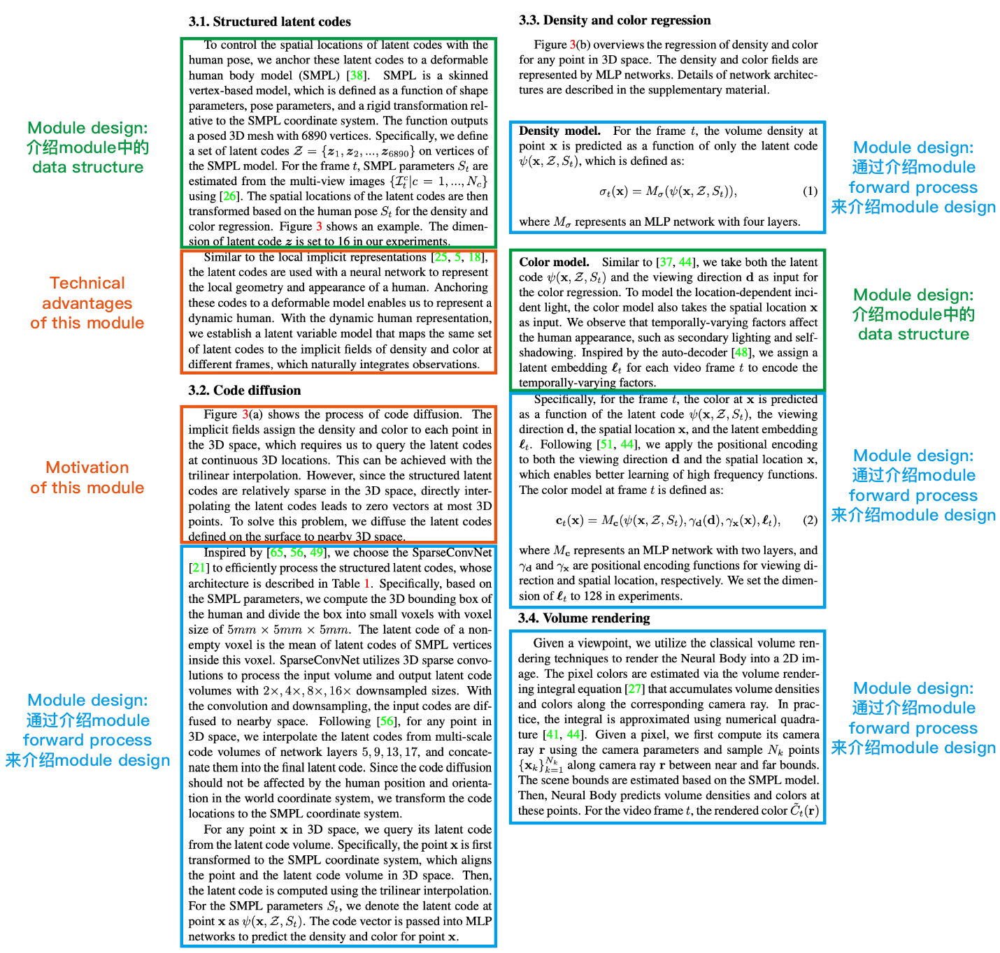

</details>

<details>
<summary>How to write Module design</summary>

Module design usually has two parts:

1. A description of some specific data structure or network structure in the module.
2. Describing the module design clearly by describing the module's forward process: given xxx input, step one does xxx, step two does xxx, step three does xxx, finally producing xxx output.

<details>
<summary>Using Instant NGP as an example</summary>

<!-- the editable instant_ngp.ai is not downloadable from Notion -->
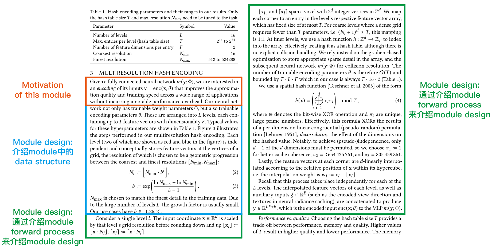

</details>

</details>

<details>
<summary>How to write Module motivation</summary>

Motivation is usually written in a problem-driven way: because a problem exists, we design xx to solve it.

Typical opening sentences:

1. A remaining problem/challenge is …
2. However, we …
3. Previous methods have difficulty in …

</details>

<!-- Method写作常见问题.pdf is not downloadable from Notion -->

<details>
<summary>How to check whether your Method is easy-to-understand</summary>

1. Outline level: after finishing the paper, summarise the Method's outline again and see whether the thinking flows.
2. Paragraph level: the first sentence of a paragraph must tell people what the paragraph is about, and one paragraph must express one thing well.
3. Sentence level:
   1. Check carefully whether the motivation of every sentence in the Method is clear. Keep the reader clear at all times about one thing: why the "content" in this sentence has to be carried out.
   2. Check carefully that the sentences flow between each other. (For what flow means, see that document.)
   3. Check carefully whether the terms in the paper are consistent, and try not to keep changing them.

</details>

```latex
\section{Method}
% Overview
% Section 3.1
% Section 3.2
% Section 3.3
```

<details>
<summary>Overview</summary>

```latex
% Overview
% One or two sentences introducing the setting
%% Example: Neural Body states the input, a sparse multi-view video of a performer, and the task, generating a free-viewpoint video.
%% Example: a pose estimation paper states that given an image, the task is to detect objects and estimate their orientations and translations in 3D space.

% One or two sentences introducing the paper's core contribution
%% Example: NSFF (Li et al., CVPR 2021) says it builds on prior static-scene work, adds the notion of time, and estimates 3D motion by explicitly modelling forward and backward scene flow as dense 3D vector fields.
%% Example: deep snake credits the prior work it follows, then states that it segments by deforming an initial contour to match the object boundary.
%% Example: a pose paper credits recent two-stage methods, detecting 2D keypoints with CNNs then computing pose with PnP, and states its own innovation, a new keypoint representation plus a modified PnP.

% If the paper's pipeline/framework is fairly novel, draw a figure introducing the pipeline/framework
%% Example: one sentence pointing at the overview figure.

% What Section 3.1 describes
%% Example: Neural Body starts from structured latent codes attached to a deformable human model's surface, with the section reference.
%% Example: an MLP maps paper first describes modelling 3D scenes with MLP maps, with the section reference.

% What Section 3.2 describes
%% Example: Neural Body obtains the latent code anywhere near the surface by a code diffusion process, then decodes density and colour, with the section references.
%% Example: the MLP maps paper then discusses representing volumetric video with dynamic MLP maps, with the section reference.

% What Section 3.3 describes
%% Example: the MLP maps paper finally introduces strategies to speed up rendering, with the section reference.
```

</details>

<details>
<summary>Section 3.1</summary>

The basic outline:

1. Motivation of this module
2. Module forward process/Module design
3. Technical advantages of this module

<details>
<summary>Using Neural Body as an example</summary>

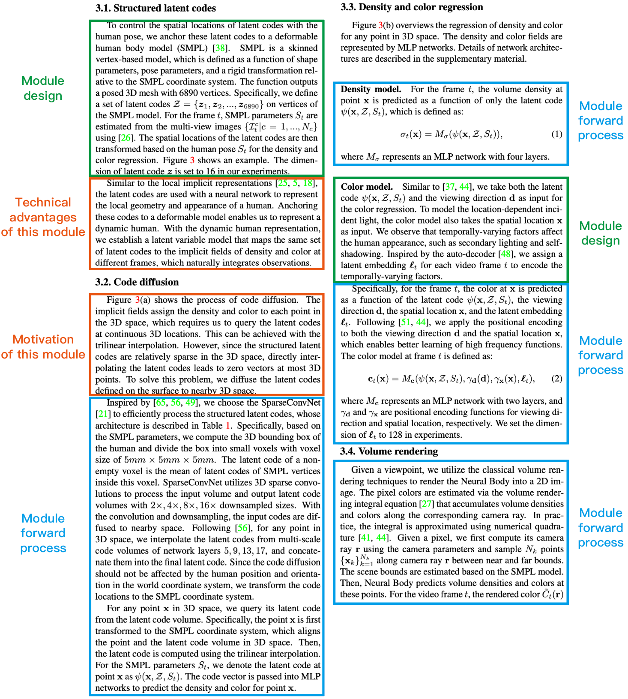

</details>

</details>

</details>

<details>
<summary>Implementation details</summary>

Hyperparameters such as the number of network layers and the feature vector dimension; implementation details such as coordinate transforms and coordinate normalisation.

Usually mentioned at the end of the section, or in the implementation details section.

</details>

<details>
<summary>Drawing paper figures</summary>

[Paper figure template](./review-a-paper/paper-figure-template/README.md)

> **note** The Method figure matters a lot. The pipeline figure in the Method has to look different from previous methods. Otherwise it gives the reader the impression that there is no novelty. If the whole pipeline (from input to output) is not very novel, the novel module should be highlighted in the pipeline figure. Another way is to draw several small figures rather than one big one, but then the paper may not look as beautiful.

The pipeline figure is not there to make the reader understand, it is there to highlight novelty. The text of the Method is what makes the reader understand.

The positive examples are NSFF and KiloNeRF, the negative example is AniSDF.

</details>

<details>
<summary>Drawing paper tables</summary>

See this tutorial: https://x.com/jbhuang0604/status/1626372600824844289

Fairly good-looking tables:


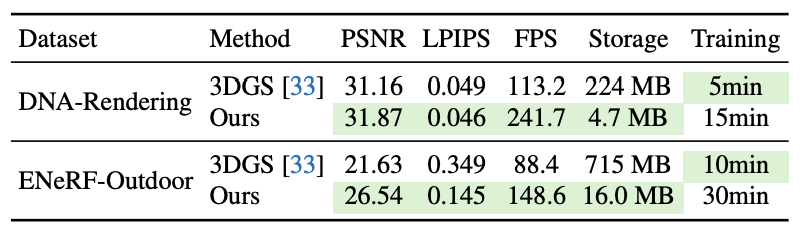

Iterating step by step:

1. Put the Caption above the Table

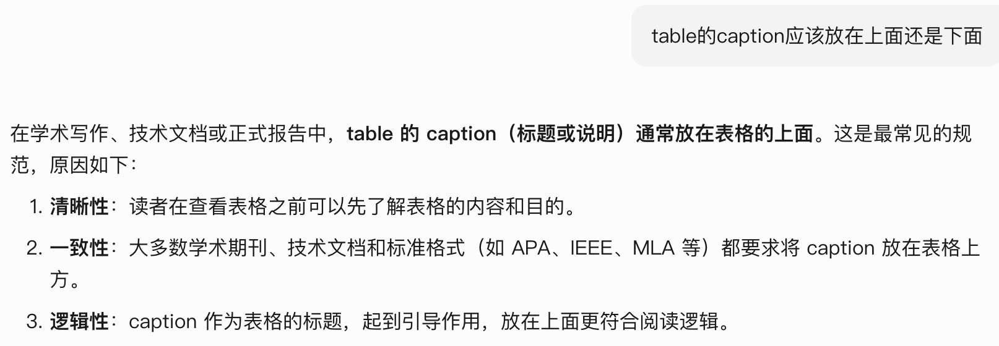

2. Avoid vertical lines where possible, and do not join vertical and horizontal lines: change `hline` in LaTeX to `toprule`, `midrule`, `bottomrule`

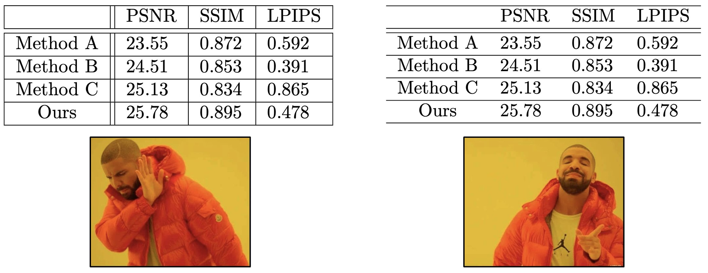

3. Avoid horizontal lines where possible, since they disturb the eye

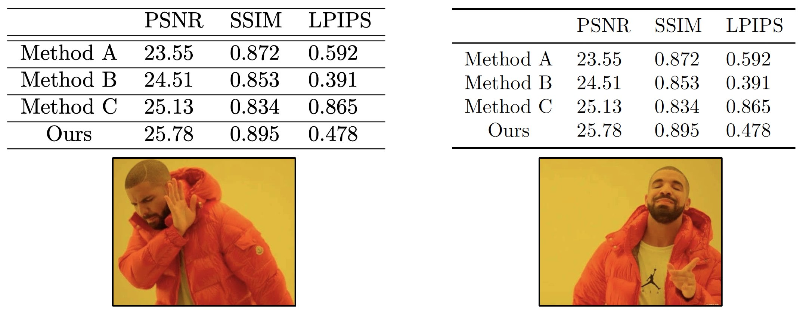

4. Colour the highlighted numbers

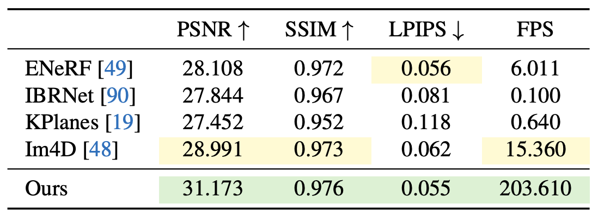

</details>

<details>
<summary>Experiments</summary>

> **note** To write good Experiments, three questions need answering:
> (1) How do we prove our method is stronger than existing methods → which comparison experiments to run.
> (2) How do we prove the modules in the method are effective → which ablation studies to run.
> (3) How do we fully show the ceiling of our method → on which more challenging data to make a demo.

> **note** In the text of the Experiments, the captions of the figures and tables matter most.

The Table caption and Figure caption need to state the experimental setting and the notation clearly. If there is nothing much to say, one sentence briefly describing the experimental result is fine.

The content of a Caption should not discuss the experimental results at length, since that easily repeats the main text.

> **note** A typesetting tip for experiment figures and tables: a single-column figure or table looks better in the right column of the paper, because people's reading habit is to look for the first line of text at the top left.

<details>
<summary>Which comparison experiments to run</summary>

<details>
<summary>Version 1, baseline methods exist</summary>

You need to compare against related, fairly recent baseline methods.

</details>

<details>
<summary>Version 2, the task is very new and there are no directly related baseline methods</summary>

<details>
<summary>Some examples</summary>

1. Example 1, construct variants of the method

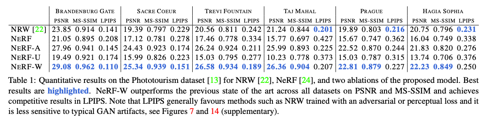

</details>

</details>

</details>

<details>
<summary>Which ablation studies to run</summary>

A paper contains some core contributions and some design choices inside each pipeline module. Readers usually care a lot about the effect of the core contributions on performance, and are curious whether those design choices are really useful.

So ablation studies usually need two parts:

1. One big table with matching visual comparison figures, listing the effect of the paper's core contributions and of some important components on the method's performance.

<details>
<summary>Some examples</summary>

1. Example 1

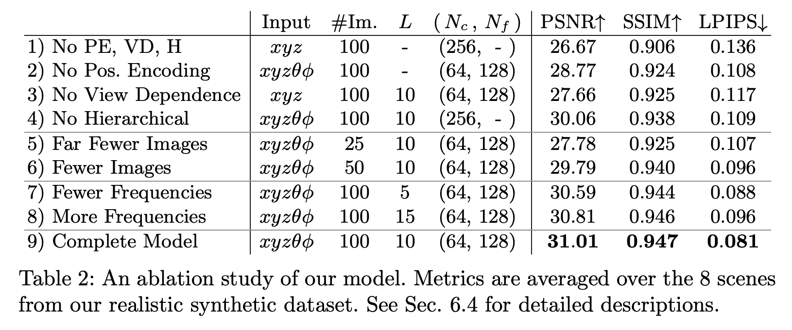

2. Example 2

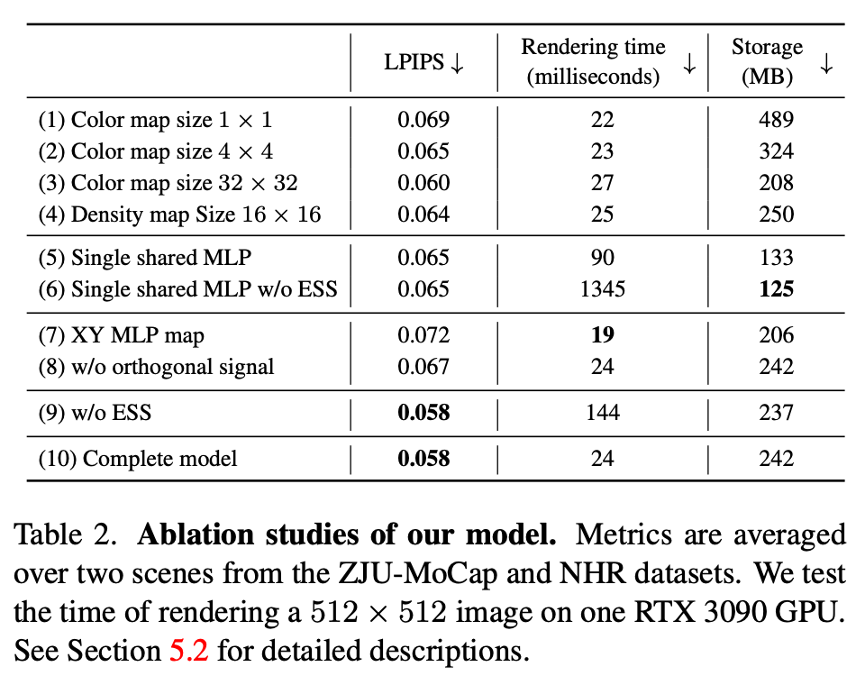

3. Example 3

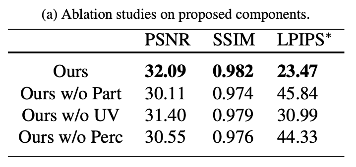

</details>

2. Some small tables with matching visual comparison figures. Each small table separately lists the effect of the design choices in one pipeline module on the method's performance (the method's sensitivity to hyperparameters, the method's sensitivity to input data quality, the effect on performance of not adopting some design choice).

<details>
<summary>Some examples</summary>

1. Example 1

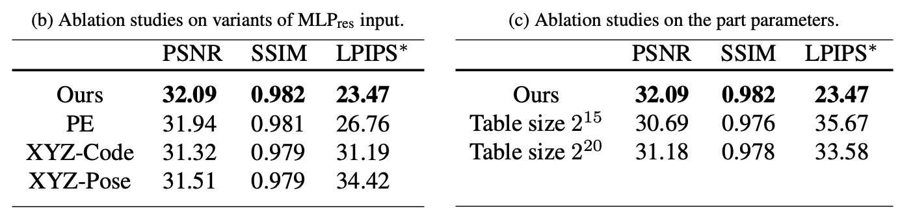

</details>

</details>

<details>
<summary>Which applications/demos to make (this has a very large bearing on the paper's impact)</summary>

[How to make an attractive demo and application](./review-a-paper/paper-figure-template/attractive-demo-and-application/README.md)

</details>

</details>

<details>
<summary>Related work</summary>

> **note** To write good Related work, the steps are:
> (1) First, list the papers that are fairly related to your paper's method. (The most important part of Related work. If it is not discussed, some reviewers will reject the paper on that alone.)
> (2) Then, based on the paper's research direction and algorithmic technique, decide which topics the Related work should discuss, and list the papers to discuss under each topic.
> (3) Finally, based on the papers listed in the first two steps, organise the outline of the related work.

</details>

<details>
<summary>Conclusion</summary>

Besides the usual Conclusion content, you also need to write Limitations, otherwise reviewers often treat "no limitations written" as a weakness.

Limitations usually describe limitations caused by the task goal or the task setting (similar to discussing future work). Do not write about technical defects.

<details>
<summary>Example</summary>

1. A limitation sentence of this shape: common videos run for more than a few minutes, but this work only handles videos of 100 to 300 frames, which is relatively short and limits the applications, and modelling a long volumetric video remains an interesting problem.

</details>

<details>
<summary>Additional explanation of the above</summary>

Some students have doubts about the statement above, see that issue. The question is what the essential difference is between a "technical defect" and "a limitation caused by the task goal or task setting", as follows:

> I do not quite understand the Conclusion part.
> About the Conclusion, you wrote: Limitations usually describe limitations caused by the task goal or the task setting (similar to discussing future work), do not write about technical defects.
> Then you gave this example:
> the 100 to 300 frame limitation sentence above.
> For your example, in my view "this work only deals with videos of 100 to 300 frames" also counts as a technical defect, namely that the method cannot handle long sequences.
> I want to know the essential difference between a technical defect and a limitation caused by the task goal or task setting.
> For instance, my proposed algorithm consumes less memory than current methods but takes longer to train. Does that count as a technical defect or a defect caused by the task goal?

My reply, "as long as it is not below the metric of current SOTA methods, it is not a technical defect", as follows:

> The difference between a "technical defect" and "a limitation caused by the task goal or task setting" really is fairly blurred.
> Generally speaking, a paper should improve one metric without clearly harming the other metrics.
> In your example, "the proposed algorithm consumes less memory than current methods, but takes longer to train", if it harms existing metrics then people may treat it as a serious limitation.
> In my example, "this work only deals with videos of 100 to 300 frames", because current SOTA methods can basically only handle fairly short videos, it really is future work.

</details>

</details>

<details>
<summary>How to revise a paper</summary>

At the end of the paper, add a self-review question list in five areas. Ask questions in each of the five areas, then revise the paper based on those questions:

1. **Contribution is not enough** (the paper brings the reader no new knowledge, which usually includes several of these: the failure cases you want to solve are very common; the proposed technique is already well-explored, and the performance improvement it brings is predictable or well-known; the technique is fairly straightforward)
2. **The writing is unclear** (technical details are missing, so it is not reproducible; some method module lacks motivation)
3. **The experimental results are not good enough** (only a little better than previous methods; better than previous methods, but still not good enough)
4. **The experimental testing is not thorough** (missing ablation studies; missing important baselines; missing an important evaluation metric; the data is too easy to prove whether the method really works)
5. **There are problems with the method design** (the experimental setting is not realistic; the method has technical defects and looks unreasonable; the method is not robust and needs hyperparameter tuning per scene; the new method design brings a benefit but introduces a stronger limitation at the same time, so its net gain is negative)

</details>

> **note** Take care that every claim in the paper (especially the claims in the abstract and introduction) must not be wrong, and must have experiments supporting it. Otherwise some reviewers will reject the paper on that alone.

A very important way to guarantee a paper's quality: pursue perfectionism.

1. Adversarial writing: review your own paper, consider every question a reviewer might ask, and solve them one by one.

[How to review a paper](./review-a-paper/README.md)

2. Ask your own advisor for revision comments on your paper, the more the better (this amounts to a reviewer reviewing the paper in advance. The more revision comments your advisor gives, the fewer questions reviewers can raise, if you fix them).
