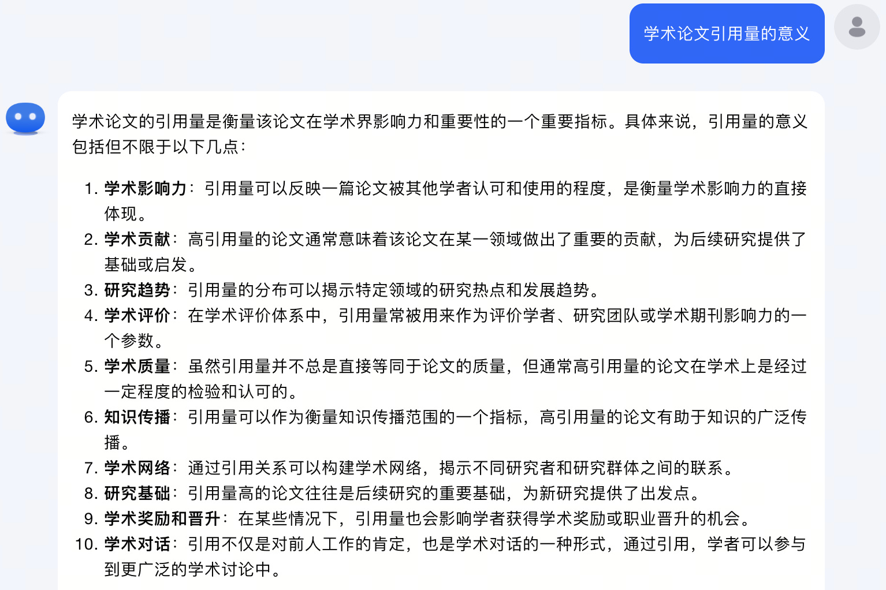

<!--
source: notion page 如何做出有影响力的工作 (nested under 怎么做吸引人的demo和application, under 论文画图模板, under 怎么审论文, under 论文写作模板)
source page id: c1a22465a0fa4b15a12985223916048e (root) -> 怎么审论文 -> 论文画图模板 -> 怎么做吸引人的demo和application -> 如何做出有影响力的工作
source fetched: 2026-09-11
status: unverified
figures: 2, the author's originals, English redraws pending
-->

# How to Do Influential Work

> Collected documents (GitHub repo): https://github.com/pengsida/learning_research

Why increase a paper's citation count:

1. What a paper's citation count means

2. How a paper's citation count helps with finding a job

How to increase your own paper's citation count:

1. The characteristics of highly cited papers: either they invested early in a very important direction that everyone then comes to work on, such as DreamFusion; or they produced a very general tool that every field comes to use, such as NeRF and Implicit Neural Representation.

   Aim for papers with that kind of high citation count.

   > **note** It is similar to starting a company. A successful business either has a good eye for which direction to invest in, or has a product that is very good to use.

2. Once a paper is finished, how to increase its citation count:
   1. Increase the paper's readership: make a beautiful project page and demo, and promote your work on social media.
   2. Increase the use of the paper's algorithm: open-source the code as early as possible, and maintain the code's README well and reply to code Issues.

What kind of behaviour leads to a very low citation count:

1. Not promoting your own paper, and not putting the paper on arXiv.
2. Not open-sourcing the paper's code, so nobody can use the paper's tool.

The downside of a low citation count: people may tend to feel that this person's work is not good enough.
