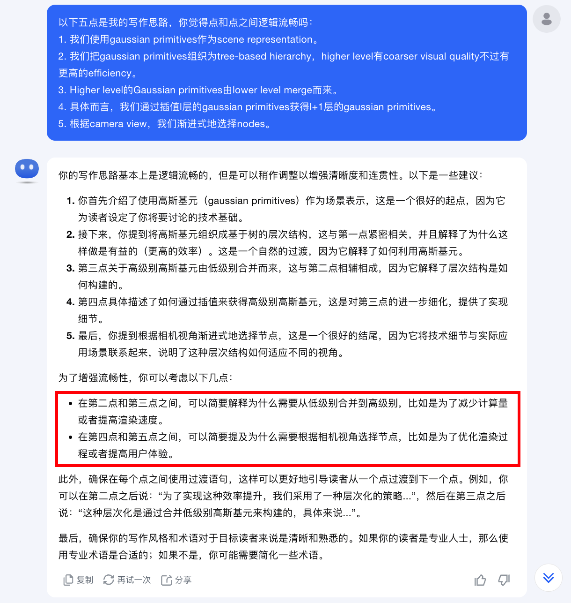

<!--
source: notion page 如何改一篇论文的写作 (nested under 论文写作模板)
source page id: c1a22465a0fa4b15a12985223916048e (root) -> 如何改一篇论文的写作
source fetched: 2026-09-11
status: verified by fable, 2026-09-11 (findings applied)
figures: 2, screenshots of his own GPT session, used as-is
-->

# How to Revise a Paper's Writing

> [Original Article](https://pengsida.notion.site/1293fe292ff180bfa5deeed526821d78)

> **note**
> Why this document was written: iteratively improving the paper is the key to writing a good one.

> **Translator's note.** The worked examples on this page revise a paragraph from an unpublished paper draft about hierarchical Gaussian primitives. The draft prose itself is not reproduced here; each example says what the paragraph covers, and his own encoded outline and analysis are translated in full, since those are the parts that teach the method.

#### Improving the outline

For the abstract, the introduction, the method, or any single paragraph, the steps for improving its outline are:

1. **Encode**: turn the raw text into a high-level outline.
2. **Analyse at the level of the outline**: answer the following two questions, in order to find where the logic of the outline is unreasonable:
   1. Does this outline express the content you want to express?
   2. Is the logic of the outline smooth?
3. **Improve at the level of the outline**: fix the unreasonable parts by editing the outline.
4. **Decode**: turn the high-level outline back into raw text.

<details>
<summary>A concrete writing example (useful, worth reading)</summary>

1. The paragraph to improve.

   The raw text is a Method paragraph from a draft. It credits prior hierarchical Gaussian work, states that the scene is represented with Gaussian primitives, describes organising them into a tree hierarchy of `L` levels where a higher level is coarser but more efficient, says higher-level primitives are merged from lower-level ones, spells out that merging as interpolating every attribute of a level `l` primitive to obtain level `l+1`, and closes on selecting nodes to render by camera view and manually setting node velocity from tracking information.

2. Encode, turning the raw text into a high-level outline.

   ```
   High-level outline:
   1. We use gaussian primitives as the scene representation.
   2. We organise the gaussian primitives into a tree-based hierarchy; a higher level has coarser visual quality but higher efficiency.
   3. The gaussian primitives of a higher level are merged from the lower level.
   4. Specifically, we obtain the level l+1 gaussian primitives by interpolating the level l gaussian primitives.
   5. According to the camera view, we progressively select nodes.
   ```

3. Analyse at the level of the outline, answering the following two questions:

   1. Does this outline express the content you want to express?

      > **note**
      > Which content do we want to express:
      > - The concrete design of this hierarchy tree.
      > - The motivation for designing this hierarchy tree.

      > **note**
      > Can the current outline express those two points:
      > - For "the concrete design of the hierarchy tree", the current outline is fairly rough and does not explain clearly how it is designed.
      > - For "the motivation of the hierarchy tree", the current outline does not mention it.

   2. Is the logic of the outline smooth?

      GPT can be used to help judge this. GPT can find the places where the logic is not smooth:

      

4. Improve at the level of the outline, arriving at a better version of the high-level outline.

5. Decode, turning the high-level outline into English text.

</details>

#### Improving sentence flow

The definition of sentence flow: the logic between two sentences is coherent, with no sudden jump.

How to improve sentence flow:

1. For every pair of sentences, answer the following questions, in order to find where the sentence flow between them is unreasonable:
   1. Does the second sentence carry on saying something from the first sentence?
   2. If the second sentence does not carry on from the first, is there a transition between them?
   3. Does the second sentence introduce a new term, and does that term appear abruptly?
2. Based on the unreasonable parts, edit the two sentences so that they follow sentence flow. GPT can be used to help.

<details>
<summary>A concrete writing example (useful, worth reading)</summary>

1. Two sentences.

   The raw text is the last two sentences of the same draft paragraph: the one spelling out the attribute interpolation from level `l` to level `l+1`, followed by the one about selecting nodes by camera view and manually setting node velocity from tracking information.

2. Judge whether they follow sentence flow. GPT can find where the sentence flow is unreasonable:

   

3. Based on the unreasonable parts, edit the two sentences.

</details>
