<!--
source: notion page 如何使用copilot和gpt辅助英语写作 (nested under 论文写作模板)
source page id: c1a22465a0fa4b15a12985223916048e (root) -> 如何使用copilot和gpt辅助英语写作
source fetched: 2026-09-11
status: unverified
figures: 17, screenshots of his own Copilot and GPT session, used as-is
-->

# How to Use Copilot and GPT to Help with English Writing

> Collected documents (GitHub repo): https://github.com/pengsida/learning_research

A full screen recording of using Copilot and GPT to help write an Introduction: https://www.bilibili.com/video/BV1jdxDeZEtq

> **note**
> The core of this technique: first list the outline clearly and get straight what you want to express, then use AI to help with the English writing.
> The outline has to be detailed down to knowing what each single sentence says.

What an outline is

An outline means the way the author organises the article's content during writing.

A paper has outlines at several granularities:

1. Section-granularity outline
2. Sub-section-granularity outline
3. Paragraph-granularity outline
4. Sentence-granularity outline

**Section-granularity outline**: work out clearly what each Section writes about.

Generally a paper's Sections are divided into

1. Abstract
2. Introduction
3. Related work
4. Method
5. Experiment

so the Section-granularity outline is fairly settled.

**Sub-section-granularity outline**: work out clearly what each Sub-section writes about. Usually only the Method and Experiment parts have sub-sections.

**Paragraph-granularity outline**: work out clearly what each paragraph writes about. Each paragraph can have only one message to express. The logic between paragraphs has to flow.

**Sentence-granularity outline**: work out clearly what each sentence writes about. The logic between sentences has to flow, and the content has to be complete.

How to write a paper's outline

List the outline from coarse to fine:

1. List the Section-granularity outline
2. For each Section, list the Sub-section-granularity outline
3. For each Sub-section, list the paragraph-granularity outline
4. For each paragraph, list the sentence-granularity outline

[Worked examples of writing outlines](./writing-outline-examples/README.md)

How to use Copilot and GPT to help write English paragraphs (full video). The basic process:

1. List the basic outline of the whole Introduction

   

   
Example

   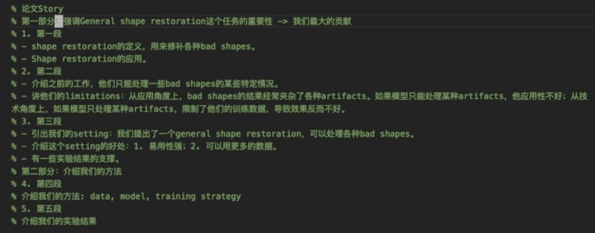

   

2. Write paragraph by paragraph

3. First list the outline of every sentence in the paragraph

   

   
Example

   

   

4. Based on each sentence's outline, write with Copilot's help

   

   
Example

   Below is the prompt to Copilot

   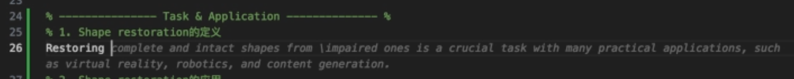

   

5. While writing sentence by sentence, refine the paragraph's outline (the key to a clear paragraph outline)

   

   
Example

   Version 1:

   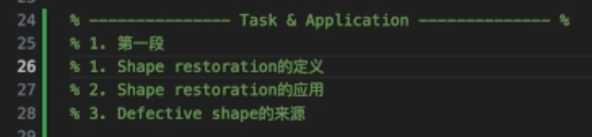

   Version 2:

   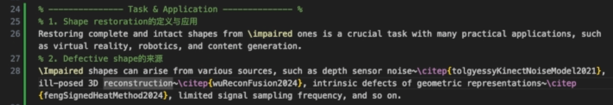

   Version 3:

   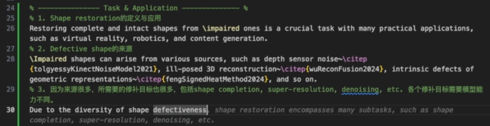

   Version 4:

   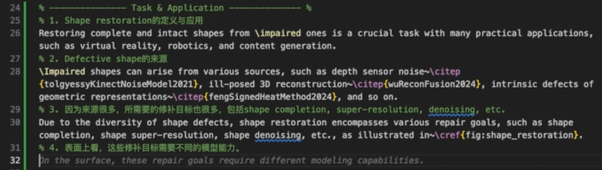

   Version 5:

   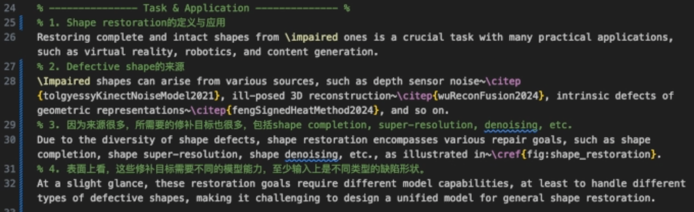

   

How to use Copilot and GPT to help write English sentences (full video). The basic process:

1. First list the outline of one sentence

   

   
Example

   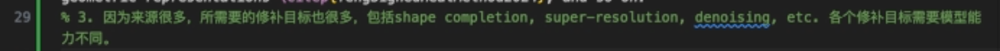

   

2. Based on that sentence's outline, write with Copilot's help

   

   
Example

   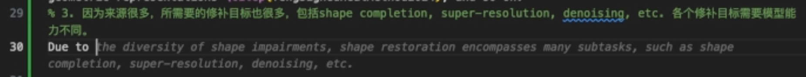

   

3. The vocabulary Copilot gives is not necessarily accurate, so polish it with GPT's help

   1. Approach 1: mixing Chinese and English, ask it directly to improve the English sentence (useful)

      

      
Example

      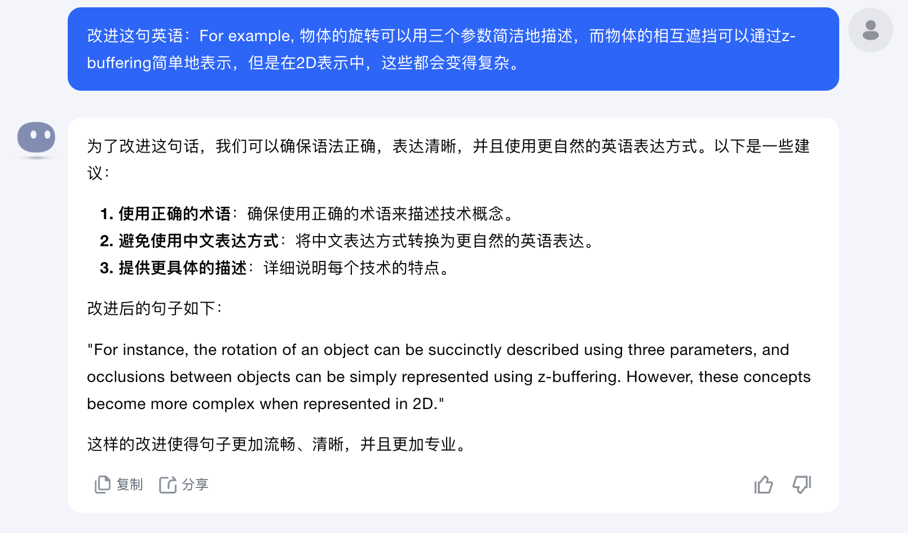
      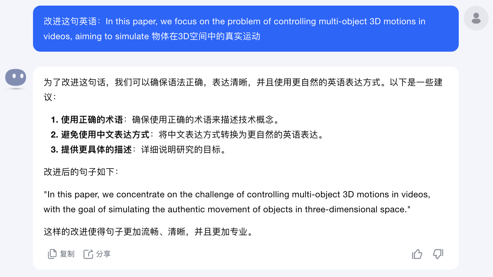

      

   2. Approach 2: ask about individual words

      

      
Example

      
      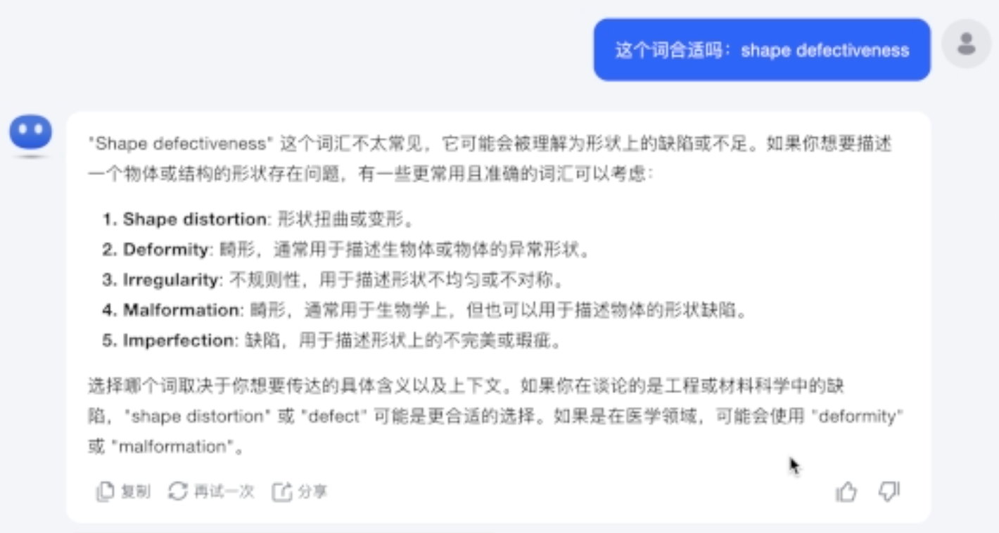
      

      

4. Based on the English sentence Copilot and GPT give, polish it once more yourself

5. While writing the sentence, refine the sentence's outline

   

   
Example

   Version 1:

   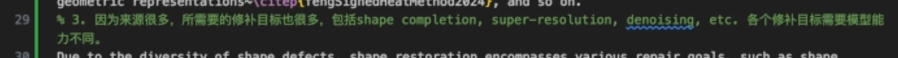

   Version 2:

   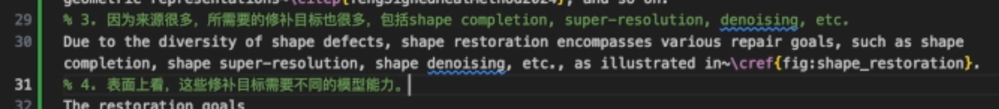

   

