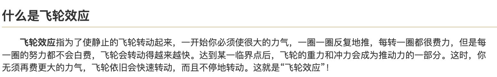

<!--
source: notion page 科研学习与课程学习的不同之处
source page id: a3fe9f17-b8af-4655-8cd1-112627009c83
source fetched: 2026-09-11
status: verified by sonnet, 2026-09-12 (findings applied)
figures: 5 in the source. Four are screenshots of other people's documents and are described rather than copied in; one is his own and is kept.
-->

# How Research Study Differs from Course Study

> [Original Article](https://pengsida.notion.site/a3fe9f17b8af46558cd1112627009c83)

> **Translator's note.** Four of the five figures are screenshots of other people's material: a strong researcher's research-teaching document, Prof. Xiangyang Shen's research experience, and Feynman on research. The source embeds them without giving a source link, so each is described where it appears rather than copied in. His own text is translated in full.

This document is mainly summarized from a strong researcher's research-teaching document

The source embeds two screenshots of that document, without a source link.

Difference in how you learn, 1

Course study may build a habit: finish learning a course, then use the course knowledge to do the homework.

Research study means learning the algorithm and using the algorithm at the same time, learning it through using it. Make good use of ChatGPT. (By analogy with course study, it is like starting the homework before you have learned the course material, then looking the material up as you go. GPT is a super retrieval engine.)

Difference in how you learn, 2 (important)

In course study, because the course requires that you not copy answers and that you finish the homework alone as far as possible, you may build the habit of working a problem or an algorithm out entirely by yourself.

In research study, make good use of all sorts of resources to learn efficiently, distilling knowledge from all sorts of places. See this document for details: [https://www.notion.so/pengsida/903b997097d343dbaba6d5e0780eab0f](https://www.notion.so/pengsida/903b997097d343dbaba6d5e0780eab0f)

Difference 3

Course study requires competing with each other:

One annoying thing about course marking is the normal distribution: in each class only the top few percent can score above 90.

That setup makes high marks a limited resource. Students inside the class have to grind against each other, constantly raising their own level and overtaking others, and only then can they get a share of it.

Research study does not require competing with each other:

In research you work on your own paper. You are creating new value, not fighting over some limited resource.

A research project is something you conceive and explore yourself, not something pre-set and awarded to the highest bidder.

> **note** Please do not bring a grinding, competitive mindset into the lab. Research calls for cooperating with each other and talking to each other.

Difference 4: the body of knowledge

In course study the body of knowledge is generally very complete: there are good textbooks and tutorials, every point you need to learn has been organized, and you can just learn it step by step.

In research study, because what you are learning is fairly close to the frontier, the points you need are scattered. Even where a tutorial exists online, it is also very likely to be poorly organized, and cannot directly present the knowledge you need. Learning the knowledge involved in frontier research through courses and books usually needs you to learn a large amount of extra, unrelated material.

> **note** In research study, your lab's advisor and senior students are a complete body of knowledge that walks.
> You high-scoring undergraduate stars: however you normally look things up in textbooks and tutorials, treat your advisor and your senior students as the textbook and the tutorial, and ask and learn from them.

Difference 5: the mental preparation for solving a problem

Research and course study differ a great deal.

- Course study: a course problem always has an answer, and the teacher already knows it, so they can make the course structured and help you reach the answer step by step.
- Research: on this problem, we ourselves are very likely the people who know the most and have thought the deepest, beyond our own advisor. The advisor does not know the correct solution, and can only explore it together with you.

That fact means you have to solve the problem independently.

Mental preparation for running experiments

Unlike course study, where homework usually goes wrong only a few times, a research experiment is very likely to fail dozens of times or more. Most research results come from iterating through a large number of failed experiments.

When an experiment fails, you cannot simply say the solution does not work and swap in another one, as you might in a course. Research requires analyzing why the current experiment does not work.

Become someone who dares to fail, and analyze the reason for failure from the failed results, so as to improve the current solution.

Be prepared to talk things over often

In course study, learning alone is fine, because the course content is laid out and you can just follow it.

In research there is no clearly correct path. We are not certain we are right, which is why we have to talk our ideas over with other people often.

How thinking of a solution differs from course study

Doing homework in a course usually requires not looking at the answer, and ideally solving the problem entirely without outside tools.

Research is very different.

In research, when thinking of a solution, you need to first go and feel for the shoulders of giants. See whether an existing algorithm can solve the problem, then see whether a nearby algorithm can.

> **note** In research, search first, then re-search. The ability to search for nearby algorithms matters a great deal.

Zhilin Yang's view: the essence of technique is combining methods, combining small techniques into large ones, and combining old techniques into new ones.

Learning knowledge may be very hard at first, but if you keep at it you can see the flywheel effect that people themselves have.

Feynman on a truth in research: the source embeds a screenshot of this, without a source link.

Reference material:

Prof. Xiangyang Shen's research experience

The source embeds a screenshot of it, without a source link.

<!-- How to do research.pdf is not downloadable from Notion -->
<!-- 众多高水平科研工作者认为的一个Top Ph.D. student所需要的品质.pdf is not downloadable from Notion -->
